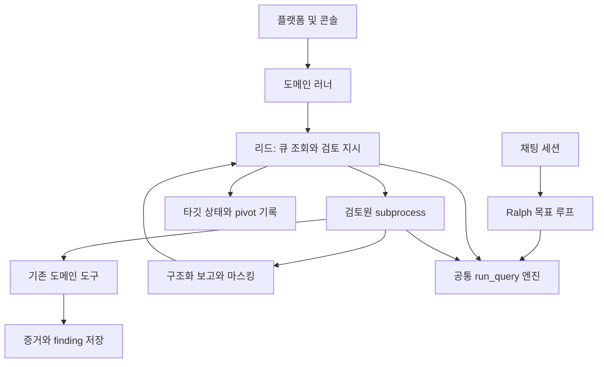

# 현재 시큐몬 구조 분석

2026-09-05 · 제공 아카이브의 정적 분석 · 운영 상태를 조회한 결과가 아님

## 핵심 결론

**기존 도구·도메인 지식·유용한 계약을 재사용하고, 범용 업무의 지속형 실행·기억·협업 체계를 만드는 방향을 권고한다.** 코어에는 장기 작업을 위한 일부 기능이 이미 있다. 그러나 실제 리드 경로는 채팅의 목표 관리·LLM 요약 경로와 분리되어 있고, 검토원 대화와 미완료 조사의 복구가 프로세스 수명에 크게 의존한다.

이 문서는 전 파일을 줄마다 검수한 완전한 보안 감사가 아니다. 전체 파일을 복원·분류한 후 엔진, 리드/검토원, 압축, 결과 계약, 정책 경계, 플랫폼 연결을 중심으로 호출 경로를 추적했다. 포함된 DB·실제 finding 원문·비밀 설정값을 결과 문서에 전재하지 않았다.

사용자 추가 방향: 제품은 범용 에이전트다. 아래의 사건/보안 용어는 기존 시큐몬을 설명하는 것이며, 새 코어를 보안 업무로 한정하는 요구가 아니다. 범용 목표 구조는 `02-target-design.md`에 정리했다.

v0.4 방향: 사용자가 말한 영업 에이전트는 사람 대화 역할이다. Python 없는 TypeScript + Node.js 신규 제품을 우선 비교하며, 기존 코드는 유지 후보와 업무 규칙·계약·시험 참고로 평가한다. 아래 재사용 표는 자산의 가치에 대한 후보 분류이며 실행 코드 유지 결정이 아니다. [언어 전환 전략](/Users/seunghanee/Documents/secumon/design/06-language-and-migration.md)

## 1. 압축 복원과 분석 기준

| 항목 | 확인 결과 |
|---|---|
| 입력 | `Gmail.zip`, 2,653,497 bytes |
| 내부 | `digisecu-code-20260905.tar.xz.part0` ~ `part3` |
| 복원 | 0→3 순서 병합, XZ 해제, tar 복원 |
| tar 구성 | 일반 파일 1,967개, 디렉터리 279개, 심볼릭 링크 2개 |
| 일반 파일 합계 | 18,680,147 bytes |
| 중첩 압축 | 복원된 일반 파일 이름의 zip/tar/xz/gz/tgz/7z/rar/bz2/zst 확장자 기준 추가 아카이브 없음 |
| 미복원 항목 | 원래 서버의 절대경로를 가리키는 설정 심볼릭 링크 2개. 대상 바이트는 아카이브에 없으므로 링크 메타데이터로 보존 |
| 무결성 | 원본·분할본·병합본·추출 일반 파일 SHA-256을 `extraction-manifest.json`에 기록 |

`archive-work/`에 조각과 병합본, `extracted/`에 복원본을 보존했다. 제품 소스는 변경하지 않았다. 아카이브 날짜는 파일명 기준이며 실제 운영 커밋·배포 버전을 증명하지 않는다.

| 프로젝트 | 일반 파일 수 | 역할 |
|---|---:|---|
| secu-agent | 524 | LLM/tool 엔진, 계약, 예산, 감사, 상태·목표 관리 |
| secu-agent-skill | 721 | 도메인 도구, 검토원, 리드, 수집·보고·재검증 업무 |
| digisecu-employee | 296 | React 콘솔, TS control-plane, Python gateway, Go operator |
| future-agent 작업 사본 | 426 | secu-agent 내부 `.claude/worktrees/`에 포함된 별도 사본 |

본체와 작업 사본의 공통 파일 426개 중 12개가 다르다. `engine.py`, `invoker.py`, `terminal_contract.py`, `worker_result.py` 등이 포함된다. 어느 쪽이 채택된 최신 버전인지는 아카이브만으로 확정하지 않았다. 비교 목록은 `source-inventory.json`에 남겼으며 병합하거나 지우지 않았다.

도구 정의는 Python AST의 최상위 `*Tool` 클래스와 정적 `name` 선언을 읽어 160개를 찾았다. **이는 테스트·조건부·미사용 정의를 포함한 정적 목록이며 실제 사용 가능한 도구 수가 아니다.** 해당 검색에서 문법 분석 실패는 없었다. 전체 목록은 `tool-inventory.json`을 참조한다. v0.9에서 경로 기준 테스트 40개와 비테스트 후보 120개로 분리했다. 비테스트 이름은 114개이며 복수 선언 이름 6개는 등록 환경·동작 비교 대상이다. [분류와 직접 선언 메타데이터](/Users/seunghanee/Documents/secumon/design/tool-catalog-review.json)

## 2. 현재 실행 구조

그림의 플랫폼 연결은 저장소의 책임 구분이다. 현재 배포에서 모든 경로가 가동되는지는 확인하지 않았다.

### 코어의 채팅 경로

`ChatSession`은 DB에서 대화를 복원하고 `ContextEngine`을 구성한다. `maybe_compress()`는 LLM 요약을 호출할 수 있다. `RalphController`는 목표 분해·진행 평가·무진전 판단을 담당한다. 재사용할 가치가 있는 구현이다.

근거: [secu-agent/src/secu_agent/agent/chat_session.py:265](/Users/seunghanee/Documents/secumon/extracted/secu-agent/src/secu_agent/agent/chat_session.py:265), [secu-agent/src/secu_agent/agent/chat_session.py:368](/Users/seunghanee/Documents/secumon/extracted/secu-agent/src/secu_agent/agent/chat_session.py:368), [secu-agent/src/secu_agent/agent/ralph_controller.py:228](/Users/seunghanee/Documents/secumon/extracted/secu-agent/src/secu_agent/agent/ralph_controller.py:228), [secu-agent/src/secu_agent/agent/context_engine.py:89](/Users/seunghanee/Documents/secumon/extracted/secu-agent/src/secu_agent/agent/context_engine.py:89).

### 실제 리드·검토원 경로

`run_lead_pass()` → 워커 CLI → `GuardedHarness` → `run_query()`로 연결된다. 리드는 `list_targets`, `target_hit_summary`, `open_inspection`, `ask_inspector`, `close_inspection` 등 도메인 공통 도구를 쓴다. 도구셋은 기본 8개이며 세션 기능이 켜지면 3개가 추가된다. `lead_tools()`의 실제 반환을 기준으로 확인했다.

검토원은 별도 프로세스에서 사내 원문을 읽고 `report_inspection` 결과를 만든다. 리드와 검토원은 stdin/stdout으로 질문과 답을 주고받는다.

근거: [secu-agent-skill/service/agents/lead_agent.py:213](/Users/seunghanee/Documents/secumon/extracted/secu-agent-skill/service/agents/lead_agent.py:213), [secu-agent/src/secu_agent/agent/cli.py:1047](/Users/seunghanee/Documents/secumon/extracted/secu-agent/src/secu_agent/agent/cli.py:1047), [secu-agent/src/secu_agent/agent/cli.py:1126](/Users/seunghanee/Documents/secumon/extracted/secu-agent/src/secu_agent/agent/cli.py:1126), [secu-agent-skill/plugin/bootstrap.py:245](/Users/seunghanee/Documents/secumon/extracted/secu-agent-skill/plugin/bootstrap.py:245), [secu-agent-skill/_shared/lead_tools.py:1023](/Users/seunghanee/Documents/secumon/extracted/secu-agent-skill/_shared/lead_tools.py:1023), [secu-agent-skill/_shared/inspector_channel.py:493](/Users/seunghanee/Documents/secumon/extracted/secu-agent-skill/_shared/inspector_channel.py:493).

## 3. 장기 추론 관점의 핵심 차이

| 확인 사실 | 장기 작업에서의 의미 | 변경 방향 |
|---|---|---|
| ContextEngine/요약기는 채팅 경로에 연결되어 있다 | 코어에 있다고 모든 리드 실행에 적용되는 것은 아니다 | 공통 episode 경계에서 상태 기반 컨텍스트를 조립 |
| run_query는 도구 결과 stub 후 sliding window를 적용한다 | 오래된 가설·반증·미완료 의무가 대화에서 사라질 수 있다 | 먼저 상태를 커밋한 뒤 교체 가능한 요약을 생성 |
| COMPACTABLE_TOOLS에 현재 리드 도구 이름이 없다 | 리드 출력은 해당 stub 경로로 축약되지 않고 커질 수 있다 | 도구 이름 목록 대신 결과 보존·재조회 계약 사용 |
| 검토원 세션 장부가 전역 dict다 | 프로세스 재시작 후 동일 세션을 복구하는 내구성은 제공하지 않는다 | 사건/작업/질문 ID와 결과 로그를 저장소가 소유 |
| 검토원 다음 질문에는 최종 assistant 메시지만 이월한다 | 중간 도구 증거를 작업 기억으로 자동 유지하지 않는다 | 읽은 증거 ID·커버리지·다음 질문을 구조화해 복원 |
| pivot JSONL·finding·큐 상태는 남는다 | 모든 상태가 휘발하는 것은 아니나 사건 전체 복원 계약은 아니다 | 기존 기록을 사건 상태에 연결 |
| 종료 도구·candidate ledger가 있다 | 완료 신호와 후보 정산에 대한 기존 방어 장치를 활용 가능 | 조사 목표·관측 범위·증거 유효성까지 종료 조건 확장 |
| 기본 리드 예산이 40턴, idle 300초, wall/token은 큰 센티넬이다 | 오래 기다리는 정상 작업과 무제한 비용을 분리하기 어렵다 | 사건 총예산 + 짧은 실행 예산 + durable wait |

근거: [secu-agent/src/secu_agent/agent/engine.py:198](/Users/seunghanee/Documents/secumon/extracted/secu-agent/src/secu_agent/agent/engine.py:198), [secu-agent/src/secu_agent/agent/engine.py:1053](/Users/seunghanee/Documents/secumon/extracted/secu-agent/src/secu_agent/agent/engine.py:1053), [secu-agent/src/secu_agent/agent/compactor.py:21](/Users/seunghanee/Documents/secumon/extracted/secu-agent/src/secu_agent/agent/compactor.py:21), [secu-agent-skill/_shared/session_registry.py:36](/Users/seunghanee/Documents/secumon/extracted/secu-agent-skill/_shared/session_registry.py:36), [secu-agent/src/secu_agent/agent/cli.py:675](/Users/seunghanee/Documents/secumon/extracted/secu-agent/src/secu_agent/agent/cli.py:675), [secu-agent/src/secu_agent/agent/cli.py:833](/Users/seunghanee/Documents/secumon/extracted/secu-agent/src/secu_agent/agent/cli.py:833), [secu-agent-skill/_shared/lead_tools.py:57](/Users/seunghanee/Documents/secumon/extracted/secu-agent-skill/_shared/lead_tools.py:57), [secu-agent-skill/_shared/lead_contract.py:90](/Users/seunghanee/Documents/secumon/extracted/secu-agent-skill/_shared/lead_contract.py:90).

주의: `checkpoints.py`의 checkpoint는 파일 수정 전 스냅샷/롤백이다. 조사 워크플로의 재시작 checkpoint와 다르다. `test_lead_checkpoint_enforced.py` 역시 도구 실행 검문소를 다루므로 이름만 보고 복구 검증으로 세면 안 된다. [secu-agent/src/secu_agent/agent/checkpoints.py:1](/Users/seunghanee/Documents/secumon/extracted/secu-agent/src/secu_agent/agent/checkpoints.py:1)

## 4. 중요파일을 리드에서 분리한 현재 방식

유지할 장점은 분명하다.

- 리드 전용 도구셋으로 원문 읽기 도구 노출을 제한한다.
- `LeadTool.execute()`에서 반환값과 에러를 마스킹하고 이미지를 제거한다.
- 검토원 보고는 값 대신 shape·fingerprint 등 파생값을 만들 수 있다.
- `verify`처럼 입력·출력의 범위가 제한된 동사를 사용한다.
- 검토원 권고와 리드의 큐 종료 권한을 구분한다.

근거: [secu-agent-skill/_shared/lead_tools.py:121](/Users/seunghanee/Documents/secumon/extracted/secu-agent-skill/_shared/lead_tools.py:121), [secu-agent-skill/_shared/inspector_report.py:101](/Users/seunghanee/Documents/secumon/extracted/secu-agent-skill/_shared/inspector_report.py:101), [secu-agent-skill/_shared/lead_masking.py:304](/Users/seunghanee/Documents/secumon/extracted/secu-agent-skill/_shared/lead_masking.py:304), [secu-agent-skill/_shared/lead_verbs.py:1](/Users/seunghanee/Documents/secumon/extracted/secu-agent-skill/_shared/lead_verbs.py:1), [secu-agent-skill/_shared/queue_ownership.py:43](/Users/seunghanee/Documents/secumon/extracted/secu-agent-skill/_shared/queue_ownership.py:43).

다만 다음을 구분해야 한다.

1. **LLM이 원문 도구를 못 쓰는 것과 리드 프로세스가 원문에 접근할 권한이 없는 것은 다르다.** 현재 부모 환경을 복사하고 같은 코드·증거 경로를 쓰는 subprocess 경로가 있다. 별도 OS 신원·마운트·DB 권한의 격리가 실제 배포에서 적용되었다는 증거는 이번 분석에 없다.
2. **secret/PII 마스킹은 모든 사내 기밀을 식별하는 정책이 아니다.** 경로, 자유서술, 문맥 자체가 중요 정보일 수 있다. 보고 스키마에는 원래 경로와 문맥 필드가 있다. 실제 유출을 재현하거나 확인한 것은 아니며, 보장 범위의 한계를 지적한다.
3. **요약한다고 공개 가능한 정보가 되지는 않는다.** 공정 정보나 내부 관계가 요약에 남을 수 있으므로 정보 등급을 승계해야 한다.
4. **현재 `_audit_egress()`는 사후 감사다.** 코드 자체가 이미 전송된 바이트를 되돌릴 수 없다고 명시한다. 마스킹 등 전송 전 방어는 존재하지만, 이 감사 함수 자체가 전송 전 차단을 제공하지는 않는다.
5. **메일 발송 게이트와 LLM 전송 게이트는 별개다.** 기존 delivery의 allowlist·마스킹·dry-run을 LLM 데이터 경계까지 이미 적용된 것으로 간주하지 않는다.

근거: [secu-agent-skill/service/agents/lead_agent.py:189](/Users/seunghanee/Documents/secumon/extracted/secu-agent-skill/service/agents/lead_agent.py:189), [secu-agent-skill/_shared/inspector_channel.py:503](/Users/seunghanee/Documents/secumon/extracted/secu-agent-skill/_shared/inspector_channel.py:503), [secu-agent-skill/_shared/lead_contract.py:283](/Users/seunghanee/Documents/secumon/extracted/secu-agent-skill/_shared/lead_contract.py:283), [secu-agent/src/secu_agent/agent/delivery.py:1](/Users/seunghanee/Documents/secumon/extracted/secu-agent/src/secu_agent/agent/delivery.py:1).

## 5. 재사용·개선·교체 판단

| 구성요소 | 판단 | 구체적인 변경 범위 |
|---|---|---|
| 도메인별 파서, 탐지기, 기존 조회·수집 어댑터 | 유지/새 구현 비교 | 필요한 규칙·입출력 의미를 확인하고 구현·연결·운영 총비용으로 선택 |
| SMB/GitHub/Confluence/dev_web toolsets | 재사용 | 실제 등록·권한에 맞는 선택 노출, 전 도메인 일괄 재작성 금지 |
| report/finding 제출·판정 경로 | 재사용·보강 | 기존 judge를 유지하고 증거 버전·관측 범위를 연결 |
| `register_task_toolset`, `register_task_contract`, plugin bootstrap | 계약 참고, 코드 유지는 선택 | Python 도구를 유지할 때만 기존 등록을 보존. 새 TS 도구에는 필요한 계약을 새로 구현 |
| `LeadAdapter`, `ThreadAdapter` | 재사용·보강 | 기존 도메인 상태를 새 case read model에 연결 |
| WorkerPool, GuardedHarness | 비교 기준·가드 계약 재활용 | 새 TS 코어가 업무 수명 소유. 필요한 호환 실행은 좁은 경계로 제한 |
| session registry/질문 응답 channel | 계약을 단계적으로 교체 | 인메모리 핸들은 최적화로 남기고 작업 소유권·응답을 영속화 |
| ContextEngine, summarizer, stash | 동작·계약과 독립 기능 재사용 | TS의 보존·재개 체계에서 압축 입력·저장 순서·재조회 handle·정보 등급 개편 |
| Ralph의 목표·무진전·done-critic | 판단 로직 재사용 후보 | 새 런타임과 동시에 사건을 구동하지 않도록 소유권 통합 |
| 기존 mask, egress capture/audit | 보조 방어와 검증용으로 재사용 | 별도 전송 전 release gateway와 OS/DB 격리 추가 |
| finding/state·감사·메일 스레드 | 재사용 | 기존 ID 유지, 사건 ID·실행 ID·증거 ID로 연결 |
| 플랫폼 UI, 예산·승인·operator | 재사용 | 사건 진행·차단 사유·다음 재개·근거 표시 추가 |
| 능동 검증·로그인 시험 등 별도 위험 도구 | 이번 자동 흐름에 편입하지 않음 | 존재 여부만 분류. 장기화 설계를 이유로 권한·범위를 확대하지 않음 |

호출 효율화는 측정 후 결정한다. 후보는 페이지 단위 조회, 메타데이터 우선 반환, 같은 증거 버전 재사용, 비동기 작업 handle, 중복 제거, backoff, 도메인별 동시성 제한이다. 기존의 브라우저 전용 경로 등은 과거 제약을 확인하고 유지하며, 단순히 API가 빠르다는 이유로 되살리지 않는다.

## 6. 이번 분석으로 확정할 수 없는 것

- 운영 중인 리드 플래그, 실제 모델/폴백, DB 스키마 이관 상태, 배포 커밋.
- 실제 사건 완료율·토큰 비용·반복 조회율·유출률.
- 저장소에 있는 테스트의 현재 통과 여부. 이번에는 실행하지 않았다.
- 모든 도구의 런타임 권한·오류 계약. 정적 목록은 출발점이며 P0 계약 점검이 필요하다.

README, CLAUDE, 설계 기록은 서로 시점이 다르다. 예를 들어 일부 문서는 리드 미기동 상태를 설명하지만 제공 코드에는 기동 러너가 있다. 과거 운영 숫자를 이번 확인 결과로 사용하지 않았다.
