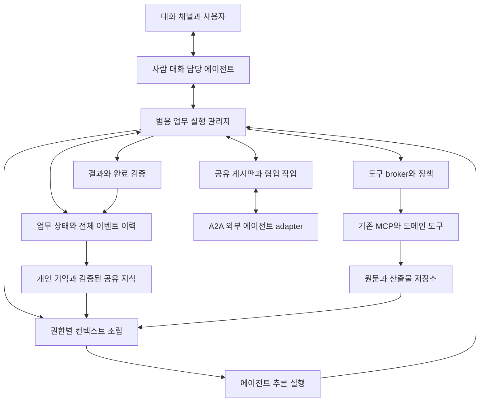
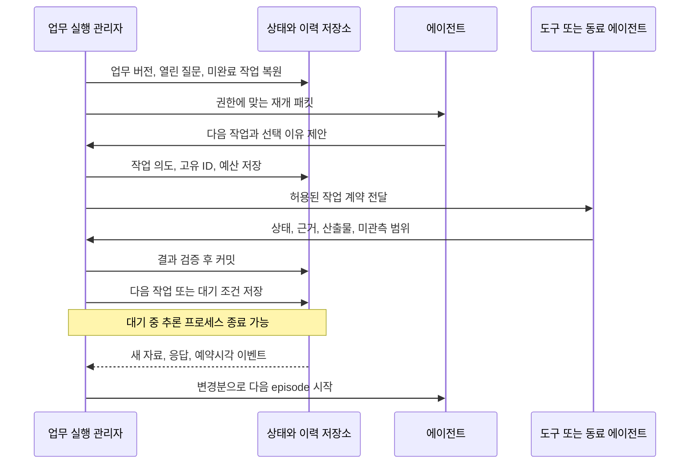

# 범용 롱 호라이즌 에이전트 설계안

2026-09-06 · v0.51 검토 반영 · 세부 구조는 설계이며 현재 구현 상태와 구분

현재 구현 순서는 [통합 플랜 C01~C10](/Users/seunghanee/Documents/secumon/design/03-migration-plan.md)을 따른다. 검토 중 논의한 전체 범위를 유지하고 담당 디렉터리/ID·지속 세션·개인 기억·범용 프롬프트/실행을 먼저 연결한다. 아래 P0~P6는 기존 기능별 분류이며 착수 순서를 강제하지 않는다.

공통 본체는 담당 디렉터리 밖에 설치하고 기본 상태/개인 기억은 담당별 SQLite, 설정·스킬·큰 원문은 파일에 둔다. 문서 기반 기억·파일 저널·PostgreSQL을 지원하며 PostgreSQL은 명시 등록한다. 게시판·아카이브는 구현 대상이지만 배치별로 켜고 끌 수 있다. 같은 담당·같은 세션은 작업 완료 뒤에도 문맥을 유지하고 필요 시 compact한다. [담당·저장 기본값](/Users/seunghanee/Documents/secumon/design/chapters/workspace-agent-defaults.md).

## 1. 제안하는 방향

**TypeScript 기반 범용 에이전트 런타임 위에 지속되는 업무·기억·협업 계층을 둔다.** 보안 에이전트 조직은 그 위의 한 구성이고, 연구·운영도 같은 코어로 실행한다. 사람이 대화하는 창구 역시 이 런타임을 사용하는 역할이다. 기존 시큐몬에서는 도구·도메인 코드·계약·감사·상태 관리의 재사용 가능한 부분을 가져온다. 언어 선택은 아래 13절과 별도 비교 문서의 권고안이다.

사용자가 제시한 요구를 네 종류로 구분하되 모두 지원한다.

| 요구 | 필요한 능력 | 코어에 들어갈 일반 개념 |
|---|---|---|
| 장시간 조사와 추론 | 가설·반증 유지, 재계획, 중단 후 재개 | 목표, 작업, 증거, 주장, 의무, 재개 상태 |
| 상시 관찰과 여러 날 후속 업무 | 변화 감지, 예약/이벤트 재개, 반복 업무 간 기억 | 구독, cursor, timer, agent identity, 관측 이력 |
| 여러 에이전트의 협업 | 발견 공유, 질문/응답, 위임, 충돌 조정 | 게시판, 메시지, 작업 계약, capability, 접근 정책 |
| 실제 사람과의 대화 | 요청 이해, 진행 설명, 변경·취소, 재접속 | 대화와 업무 연결, 인증된 지시 이벤트, 전달 상태 |

코어에 `subnet`, `SIEM`, `EDR`, `finding`, `research_topic`을 고정 필드나 분기로 넣지 않는다. 업무 모듈이 자신의 유형과 규칙을 등록한다. 범용성의 검증 기준은 “설명상 범용”이 아니라 **보안 업무와 비보안 업무가 코어 수정 없이 같은 실행·기억·협업 경로를 사용하는가**이다. 사람 대화는 업무 분야가 아니라 여러 분야에서 공통으로 사용하는 역할이다.

[메인 코어 프레임워크](/Users/seunghanee/Documents/secumon/design/08-core-framework.md)는 goal/state·가설·planner·plan validator·task graph·scheduler/executor·evidence·state update·controller·compact를 연결한다. [도구·메모리·skill·방법론](/Users/seunghanee/Documents/secumon/design/09-tools-memory-methods.md)은 선택·호출·재사용·업무 배치 방법을 같은 코어 계약에 연결한다. [채팅과 채널 설계](/Users/seunghanee/Documents/secumon/design/10-chat-and-channels.md)는 CLI·Web·Knox에서 공개 상태·응답 정책·답변 전달을 맡는다. 아직 구현·성능 검증 전의 설계다.

### 전체 범위와 구현 책임

| 묶음 | 포함할 내용 | 구현의 첫 검증과 확장 |
|---|---|---|
| 코어·제어 | 목표/실행·가설 상태, 계획/검증, task graph, 실행/근거/상태 갱신, continue/replan/wait/완료 | P1의 결정적인 루프 → 실제 모델/반증 → P2 비용/품질 |
| 저장·근거 | DB 독립 포트, 영속 adapter, 원본/산출물, 관계·개인/조직 기억, 작업 공간, 정정/삭제/복구 | P1 저장/재개 → P2 저장소 교체/조회 → P6 복원 |
| 컨텍스트 | 직접 조회, 필수 의무 보호, 미사용 명세/내용 정리, 선택 로딩, compact/재조회 | P1 최소 packet → P2 긴 실행과 반복 교체 |
| 도구·지침·방법 | catalog/버전, 호출 장부, 효과/재시도·batch/캐시, skill/방법 선택·역할 배치 | P1 작은 경로 → P2 최적화 → P3 실제 adapter → P5 bundle |
| 모델·예산·진단 | 모델 gateway, 자동/빠르게/깊게, 무진전, 부모/자식 예산, trace/replay·평가 | P1 기록/기본 정책 → P2 비교 → P4 협업 총비용 |
| 대화·컴퓨터 유즈 | 사람 대화 역할, 접수/결과 중심 CLI/Web/Knox, 관찰/행동/확인·세션·효과 | P1 CLI/대역 → P2 계약/효율 → P3 채널/선택 UI |
| 협업·지속 임무 | 지속 역할 ID, 게시판, 근거 충돌/위임, A2A, 구독/예약/관측 cursor | P4 두 역할/외부 동료/상시 재개 |
| 정보 경계·배치 | 주체/목적지·원문 접근 대안, 지침/도구 변경 승격, 운영 한도·롤백 | P0/P1 계약 → 실제 자료 전 G-DATA → P5 배치 → P6 시범 |

이 묶음은 서비스 수나 모델 호출 수를 뜻하지 않는다. [통합 구현 플랜](/Users/seunghanee/Documents/secumon/design/03-migration-plan.md)이 단계의 기준이며, [31개 구현 작업과 22개 요구 매핑](/Users/seunghanee/Documents/secumon/design/implementation-backlog.json)에 실제 선행 조건과 검증 기준을 둔다. 범용성과 정보 경계는 초기부터 검증하고, 단일 에이전트의 실제 도구/채널 연결 뒤에 협업을 확장한다.

## 2. 전체 구조

모든 실선은 권한이 부여된 데이터 경로다. `E → C`는 원문을 모든 에이전트에 전달한다는 뜻이 아니다. 컨텍스트 조립기가 주체·목적지·업무 범위에 맞는 view만 선택한다. 민감한 모델 전송은 별도 egress 정책을 통과한다.

| 계층 | 책임 | 두지 않을 책임 |
|---|---|---|
| 범용 런타임 | 추론 한 번, 도구 호출, 제한, 취소, usage | 특정 보안 도메인의 판정 |
| 사람 대화 역할 | 요청 이해·확인, 업무 연결, 진행·결과 설명 | 채팅 기록만으로 장기 업무 상태 소유 |
| 공개 상태·채널 전달 | 접수·질문·결과 표시, 알림 합치기, 전달 장부, CLI/Web/Knox adapter | 원시 실행 로그를 그대로 대화로 중계, 채널 API 수락을 읽음으로 간주 |
| 업무 실행 관리자 | 목표/작업 상태, 복구, 예산, 대기, 완료 조건 | LLM의 임의 결론을 검증 없이 확정 |
| 추론·계획 정책 | 경쟁 가설·판별 질문, 계획 제안/검증, continue/replan/complete 판단 | 모든 업무에 동일한 긴 추론 절차 강제 |
| 기억·증거 계층 | 이력, 원문, 주장/반증, 검색, 권한 | 검색 결과를 곧바로 진실로 승격 |
| 호출·방법 선택 | 도구 registry, 호출 장부, 메모리 조회, skill 로딩, 업무 방법론 | 저장 결과·지침으로 권한/완료 검증 우회 |
| 협업 계층 | 게시·구독·질문·위임·결과 전달·중복 제거 | 무제한 전체 broadcast |
| 업무 모듈 | 자료 유형, 도메인 도구, 용어, 관측·완료 규칙 | 공통 스케줄러나 별도 기억 시스템 복제 |
| 플랫폼 | 사용자 경험, 조직/에이전트 설정, 승인, 운영 가시성 | 내부 도구 구현을 복사 |

초기 구현에서 계층마다 별도 마이크로서비스를 만들지 않는다. 논리적 책임과 인터페이스를 먼저 나누고, 원문 보안 경계처럼 실제 분리가 필요한 부분만 프로세스·자격증명·네트워크로 격리한다.

## 3. 에이전트의 정체성과 실행 프로세스를 분리

에이전트는 장기적으로 유지되는 `identity + 담당 범위 + 권한 + 업무 목적 + 세션 + 기억`이다. identity는 담당의 지속 ID이고 세션은 이어지는 대화 문맥이다. 실행 프로세스는 필요할 때 이 상태를 읽어 일하는 실행 인스턴스다. 이를 worker라고 부르더라도 영구적인 하위 에이전트 계층을 의미하지 않는다.

서브넷 100개에 담당 에이전트 100개가 있다고 해서 LLM 프로세스 100개를 계속 켜둘 필요는 없다. 논리적인 담당자·기억·구독은 지속되고, 실제 추론은 제한된 worker pool에서 필요할 때 수행할 수 있다. 정확한 크기와 동시성은 측정으로 결정한다.

리드, 검토원, 탐정, 사람 대화 담당은 설정과 capability의 조합이다. **사용자가 말한 ‘영업 에이전트’는 실제 사람과 소통하는 대화형 에이전트다.** 공통 런타임을 사용하며, 요청을 내부 동료에게 위임하고 사람이 이해할 수 있게 진행과 결과를 설명한다. [대화 역할 상세](/Users/seunghanee/Documents/secumon/design/07-conversation-agent.md)

모두에게 고정된 리드 계층을 강제하지 않는다. 한 업무에서만 임시 조정자를 정할 수도 있고, 단일 에이전트가 혼자 완료할 수도 있다. 보안 사례의 내부 검토원처럼 권한 경계가 필요한 경우 역할과 배치를 분리한다.

## 4. skill 중심 구조를 어떻게 바꿀까

**skill 파일을 시스템의 중심에서 내려놓고, 실행 계약이 있는 업무 모듈과 선택적으로 읽는 지침으로 나눈다.** skill이라는 명칭을 없애는 것보다 어떤 책임이 어디에 있는지가 중요하다.

| 요소 | 새 역할 |
|---|---|
| 현재 Python 도구·파서·탐지·서비스 코드 | 코드 유지/TS 재구현/외부 서비스 사용을 비교. 업무 규칙·입출력 의미·검증 자료는 재활용 가능 |
| MCP | 기존 도구·데이터 연결. 이미 있는 SIEM/EDR MCP를 다시 만들지 않음 |
| 업무 계약 | 입력/출력, 허용 범위, 산출물, 재시도, 완료 규칙을 코드·스키마로 정의 |
| 역할 설정 | 담당 범위, 목표, 사용 가능한 도구, 예산, 구독, 모델 배치 |
| SKILL.md·플레이북 | 필요할 때 읽는 절차·전문지식. 선택 사항이며 실행 권한의 근거가 아님 |
| 기억 | 실행 중 관찰한 사실·결정·경험. skill 프롬프트와 별도로 저장 |
| A2A | 다른 에이전트에 일을 요청하고 상태·산출물을 받는 경계 |

현재 `secu-agent-skill`에는 문서만 있는 것이 아니라 도구·상태·러너·계약 코드가 이미 상당 부분 들어 있다. 유용한 규칙·계약·시험 사례를 추출하되 실행 코드 유지 여부는 신규 구현과 총비용을 비교한다. 긴 skill 본문에 실행 순서·기밀 정책·오류 처리·종료 판정을 몰아넣는 부분을 분리하는 것이 우선이다.

코어의 plugin 등록 방식은 유지할 후보지만, 업무 모듈이 전역 monkey-patch나 코어 내부 구현을 알아야만 붙는 구조는 줄인다. 좁은 계약을 통해 `도구 제공`, `자료 해석`, `검증 규칙`, `지식 제공`을 등록한다. 새 업무마다 코어를 수정하거나 새 에이전트 클래스를 복제하지 않는 것이 목표다.

업무 배치는 입력/산출물·완료 기준, 역할·권한·capability, 방법론 후보, 지침/지식 버전, 메모리 범위, 모델 목적지·예산, 합성 평가 사례를 묶은 구성으로 한다. 단순 조회·정해진 변환·비교 연구·가설 조사·대기 업무·지속 관찰에 맞게 방법을 조합한다. skill 메타데이터에서 적합한 후보를 고르고 필요한 본문/참고 자료만 활성화하며, 포함된 스크립트는 별도 tool 실행 계약을 통과시킨다.

A2A의 Agent Card에도 skill이라는 용어가 등장할 수 있다. 이는 외부에 알리는 capability 설명이며, 로컬 `SKILL.md` 중심 실행 모델을 채택해야 한다는 뜻은 아니다.

## 5. 컨텍스트를 버리지 않는 기억 구조

[저장소와 복구 상세](/Users/seunghanee/Documents/secumon/design/16-storage-and-recovery.md)에서 업무/사건/근거/기억·원본/산출물·검색/캐시·작업 공간의 기준 데이터와 쓰기 소유권을 정의한다. 사용자 요구에 따라 코어는 DB 제품에 독립적인 포트에 의존하고 배포에서 adapter를 주입한다. PostgreSQL은 가능한 구현 예시다. 에이전트별 기억은 필요한 권한·namespace와 정보 경계로 나눈다.

**보존하는 이력과 모델에게 지금 보내는 컨텍스트를 분리한다.** 같은 세션의 활성 문맥은 작업 X 완료 후 Y에서도 이어간다. 전체 기록을 매번 모델에 다시 넣거나 모든 대화를 개인 장기기억으로 옮길 필요는 없다. 한 세션에 여러 작업이 있을 수 있으며 작업 완료는 세션 종료/초기화 조건이 아니다.

| 종류 | 내용 | 권위/수명 |
|---|---|---|
| 단기 문맥/지속 세션 | 현재 대화와 관련 작업·기억 참조, compact 결과 | 담당/사용자/세션 범위로 유지. 작업을 넘어 이어가고 명시적 새 대화와 구분 |
| 전체 이벤트 이력 | 사용자 지시, 공개된 답변, 도구 요청/결과 참조, 메시지, 상태 변경 | 보존 정책 내 append-only. 재시작·감사·재구성의 근거 |
| 원문/산출물 저장소 | 원본 로그·파일·스냅샷·보고서와 버전/hash | 정보 등급·권한·보존기간 적용 |
| 업무 상태 | 목표, 완료 조건, 계획 의존성, 진행, 승인, 예산, 재개 조건 | 업무 진행의 정본 |
| 에이전트별 기억 | 담당 범위의 관찰·업무 연속성·열린 질문 | 업무/역할 ACL. 단독으로 공유 지식이 되지 않음 |
| 공유 게시판 | 공개 범위가 정해진 발견·주장·질문·반증 | 미검증과 검증됨을 명확히 구분 |
| 조직 지식 | 검증된 사례·정책·관계·예외·경험 | 출처, 소유자, 적용 범위, 만료 및 폐기 |
| 선택 아카이브 | 성공/실패/대화 사례 또는 기존 시스템의 조회 자료 | 공급자의 조회/등록 능력에 맞춰 연결. 조회했다고 개인 기억에 자동 등록하지 않음 |
| 재개 패킷 | 현재 업무에 필요한 사실·열린 질문·근거 ID·다음 행동 | 정본에서 재생성 가능. 유일한 기억으로 쓰지 않음 |

이력에는 사람이 볼 수 있는 결정과 근거 요약을 남긴다. 모델의 비공개 내부 추론 원문을 확보하는 방식에 의존하지 않는다. 사용자 지시와 비신뢰 자료의 출처도 별도로 저장해, 재조회·요약 과정에서 자료 속 문장을 상위 지시로 승격하지 않는다.

과거 전체 기록의 보존도 무제한은 아니다. 사내 보존/삭제 정책에 따라 만료되면 `원문 없음`과 영향받는 주장을 기록한다. 근거가 사라진 상태를 압축 요약으로 감추지 않는다.

### 매 추론 전에 컨텍스트를 구성하는 순서

1. 같은 담당/세션의 이어지는 문맥을 사용하고 현재 업무 상태와 권한을 확인한다. 재시작한 경우 저장된 세션을 복원한다.
2. 새 지시와 결과를 문맥에 반영하고 현재 질문에 관련된 관찰·주장·반증·의무를 고른다.
3. 필요한 원문/산출물을 허용된 범위에서 상세 조회한다.
4. 짧은 업무 브리프와 선택된 근거를 조합한다.
5. 목표·중요 반증·미완료 작업·근거 ID 누락과 정보 등급을 검사한다.
6. 해당 모델 목적지에 전송 가능한 view만 보낸다.
7. 새 결과를 검증·저장한 뒤 세션 문맥을 갱신한다. 필요한 시점에만 정리/compact하며 작업마다 초기화하지 않는다.

이전 요약을 계속 다시 요약하는 방식에만 의존하지 않는다. 숨겨진 중요 정보를 못 찾는 retrieval 실패도 평가 대상이다. 검색 실패와 근거 부재는 구별하며, 인덱스 지연·권한 제한·조회하지 않은 범위를 표시한다.

토큰 예산은 모델 한도에서 시스템/도구 명세·출력·추론 예약분을 뺀 값으로 잡고 실제 usage로 보정한다. 고정 문자 수는 보조 추정으로만 사용한다. 요약 실패 시 최소 구조화 패킷으로 재개하거나 대기하며, 필수 상태를 잃은 채 정상 완료하지 않는다.

## 6. 롱 호라이즌 추론의 단위

단순히 더 오래 실행하는 것과 더 잘 추론하는 것을 나눈다. 지속형 실행은 복구를 제공하고, 추론의 연속성은 아래 상태가 제공한다.

- 목표와 완료 기준.
- 현재 설명/가설과 경쟁하는 대안.
- 관찰 사실과 해석의 구분.
- 지지 근거, 반증, 모순, 자료의 시점과 범위.
- 다음 판별 질문과 “무엇을 알면 판단이 바뀌는가”.
- 수행한 작업과 미완료 의무, 보류 이유.

가설은 `미검증/지지됨/반박됨/추가정보필요`처럼 관리한다. 정확한 확률 숫자를 붙여 객관적인 것처럼 보이게 하지 않는다. 필요해질 때 평가를 거쳐 보정된 점수를 도입한다.

다음 작업은 업무 중요도, 예상 판별력, 비용, 지연, 권한에 따라 선택한다. 반복 호출 수나 heartbeat가 아니라 새 증거·범위 증가·가설 구분·미완료 의무 해소를 진전으로 본다. 일정 기간 진전이 없으면 질문을 바꾸거나 도움을 요청한다.

첫 구현에 모든 형태의 지식 그래프가 필요한 것은 아니다. 관계는 SQL로 저장하고, vector 검색은 필요할 때 과거 사례·증거 탐색용으로 추가한다. “특이사항 감지”와 “비슷한 사건 검색”은 다른 문제다.

실행 상태와 가설·근거의 인식 상태를 구분한다. 관찰 → 질문·가정·경쟁 가설 → 판별 질문 → 계획·검증 → 근거 수집 → 가설/상태 갱신의 루프를 필요할 때 사용한다. 가설은 예측과 반박 조건, 지지·반증, 적용 범위를 유지한다. 단순 변환은 이 과정을 생략할 수 있다. Task Graph는 작업 선행 관계이며 가설/근거 관계나 코어의 제어 루프와 동일하지 않다.

Plan Validator는 구조·계약·권한·예산과 목표 연결을 검사하고, 필요한 경우 의미 검토를 추가한다. Scheduler는 실행 직전 최신 조건을 재검사한다. Controller는 커밋된 상태에서 continue/replan/완료 후보/wait/blocked 등을 결정하고 실제 완료는 별도의 기준 검증을 거친다. 변경은 영향받는 계획 부분에 적용하고 과거 실행·근거 이력은 보존한다.

## 7. 한 업무가 여러 날에 걸쳐 진행되는 흐름

짧은 실행인 episode와 장기 업무를 분리한다. episode마다 시간·토큰 한도를 두고, 장기 업무에는 별도 누적 예산·기한을 둔다. 재실행했다고 예산을 초기화하지 않는다.

장시간 조사, 주기적 관제, 담당자 회신 대기는 같은 재개 체계를 사용한다. 상시 관제는 끝나지 않는 하나의 거대한 대화가 아니라 지속되는 임무와 그 아래의 유한한 작업들이다. 관측 cursor와 종료된 주기별 결과는 남기고 새로운 사건이 생기면 별도 업무를 연다.

전체 조직을 구동하는 거대 리드 한 명이 모든 자료를 읽을 필요는 없다. 공통 실행 관리자는 코드로 업무·예산·상태를 관리하고, 필요한 업무에만 조정 역할의 에이전트를 지정한다.

## 8. 게시판과 A2A는 어떻게 함께 쓰나

게시판은 **공유 사실·주장·질문의 작업 공간**, A2A는 **특정 상대에게 업무를 요청하고 결과를 받는 통신 경계**로 둔다. 게시판에 글을 쓰는 것만으로 특정 에이전트가 책임을 맡았다고 간주하지 않는다. 실제 위임은 명시적인 수락·담당자·기한·산출물 계약이 있는 작업으로 만든다.

게시물에는 최소한 다음 개념이 필요하다. 구체 스키마는 후속 설계에서 확정한다.

| 개념 | 이유 |
|---|---|
| 작성 주체·업무 ID·게시물 버전 | 누가 어떤 일에서 나온 내용을 공유했는가 |
| 관찰/가설/질문/반증/결정의 구분 | 의견이 사실로 둔갑하지 않게 함 |
| 근거 참조·관측 시각·자료 버전·범위 | 출처와 적용 범위를 평가 |
| 검증 상태·유효기간·철회/대체 관계 | 오래된 결론과 새로운 반증 처리 |
| 구독 주제·공개 범위·정보 등급 | 필요한 에이전트에게 허용된 정보만 전달 |
| 원인 이벤트 ID·상관관계 ID | 중복 전파와 무한 응답 루프 방지 |

게시글의 자연어 본문은 사람이 이해하는 설명으로 남긴다. 런타임의 라우팅·권한·완료 판정은 구조화된 필드를 사용한다. 원문 자료를 모든 구독자에게 broadcast하지 않고 허용된 참조나 공개 view를 보낸다. 첨부파일 URL/handle 자체도 접근 권한을 대체하지 않는다.

### 대화가 새 지식으로 발전하는 규칙

1. 한 에이전트가 근거가 연결된 관찰 또는 질문을 게시한다.
2. 관련 주제를 구독한 에이전트가 중복 여부·중요도·자기 담당 범위를 평가한다.
3. 새 근거를 찾을 수 있을 때 응답하거나 조사 작업을 수락한다.
4. 응답은 기존 주장에 대한 `supports/contradicts/clarifies/duplicates` 관계를 남긴다.
5. 충돌이 중요하면 업무별 조정자 또는 탐정 역할이 경쟁 가설을 비교한다.
6. 검증된 결론만 공유 지식으로 승격하고, 이전 결론이 바뀌면 의존 작업에 변경 이벤트를 보낸다.

다른 에이전트가 같은 게시글을 요약한 것은 독립 근거가 아니다. 근거의 원본 출처·계보를 추적해 중복 증거를 제거한다. 글이 많이 달렸다는 이유로 확신을 높이지 않는다.

### 협업 폭주를 막는 실행 규칙

- 주제·권한·역할 기반 구독을 사용하고 전체 연결을 기본으로 하지 않는다.
- 원인 이벤트별 중복 제거, fan-out 상한, 대화 깊이/횟수·총비용 예산, 기한을 둔다.
- “새 증거 없음”만 반복하는 응답은 추가 추론을 유발하지 않는다.
- 다른 에이전트에게 일을 다시 위임해도 원래 업무 예산·범위를 상속한다.
- 하나의 작업에 한 소유자를 두고, 동시 결과는 버전 검사로 병합하거나 충돌로 처리한다.
- 늦은 응답·중복 응답·철회된 게시글·사라진 상대를 정상 상태로 처리한다.

A2A는 capability 발견과 작업·상태·산출물 교환을 제공하는 경계로 검토한다. **상대 내부 기억을 공유하거나 정보 공개 권한을 자동으로 부여하는 표준은 아니다.** 구현 시 현재 명세 버전과 기존 상대 구현의 버전을 협상·고정하고, 인증·권한·timeout·취소·산출물 검증을 adapter에서 처리한다. 외부 작업 ID와 내부 작업 ID를 매핑하고 원래 상대의 provenance를 보존한다. [A2A 공식 명세](https://a2a-protocol.org/latest/specification/)

동일 런타임 안의 에이전트는 먼저 내부 메시지/작업 API를 사용할 수 있다. 모든 내부 호출까지 HTTP A2A로 바꿀 필요는 없다. 외부 에이전트와 붙는 경계에 A2A adapter를 둬도 업무 모델은 동일하다. 내부 게시판을 A2A 표준 자체의 기능이라고 설명하지 않는다.

## 9. 사용자 예시를 이 구조에 올리기

### 예시 A: 서브넷 담당자 → 공동 조사

1. 각 담당 에이전트는 자기 범위의 자산 정보와 관측 cursor를 갖는다.
2. 기존 SIEM·EDR MCP를 통해 허용된 자료를 조회한다. 이번 아카이브에는 이 MCP 구현이 없으므로 endpoint·도구 이름·결과 형식을 추측해서 만들지 않는다.
3. 많은 이벤트의 집계·증분 비교는 도메인 코드가 처리한다. 예외나 설명이 필요한 변화에서 추론을 시작한다.
4. 범위 A의 에이전트가 기존 기준선과 다른 관계를 관찰하면 근거·관측 범위를 포함해 게시한다.
5. 범위 B의 에이전트가 자기 자료에서 독립적인 관찰을 더한다. 전사 entity resolver가 가명 ID/자산 ID의 일치 여부를 관리한다.
6. 탐정 역할은 상충하는 설명을 비교하고 필요한 읽기 전용 자료 분석을 위임한다.
7. 새 자료·승인된 변경 기록·담당자 회신이 오면 같은 업무가 이어진다. 근거 부족은 정상 또는 악성 확정과 구분한다.

`자산`, `서브넷`, `관측 기준선`, `보안 분류`는 보안 모듈의 개념이다. 범용 코어는 범위·자료·주장·작업 관계만 다룬다. 기준선은 “현재 자주 보인다”와 “정책상 승인된 정상”을 구분하고, 잘못된 관측이 정상 지식으로 자동 승격되지 않게 한다. vector 검색은 유사 사례를 찾는 데 쓸 수 있지만 이상탐지 자체를 대체하지 않는다.

에이전트별 저장 공간은 필요하지만, 같은 자산의 정본을 각자 무제한 복제하지 않는다. 개인 관측·작업 기억과 조직의 canonical entity/자료 카탈로그를 나누고 출처를 보존한다.

### 예시 B: 사람 → 대화 담당 → 동료와 A2A 협업

사용자가 의도한 대화 역할은 여러 업무 분야에 공통으로 적용한다.

1. 사람이 대화 담당에게 공개 문서 두 개를 비교해 달라고 요청한다.
2. 대화 담당이 목적·완료 기준을 확인하고, 지속 업무를 저장한 뒤 접수 사실을 알린다.
3. 내부 작업 API 또는 외부 A2A로 자료 확인을 맡긴다. 동료의 응답을 기다리는 동안 사람의 추가 질문에도 대응한다.
4. 사람이 비교 기준을 변경하면 인증된 변경 이벤트로 목표 버전을 갱신한다. 상태 질문만으로 새 업무를 중복 생성하지 않는다.
5. 대화 창을 닫아도 업무와 미응답 작업은 유지된다. 재접속하면 권한에 맞는 최신 상태를 복원한다.
6. 늦은 결과는 현재 목표와 맞는지 검증하고, 근거가 연결된 결과와 남은 한계를 설명한다. 취소 시에는 요청 접수와 실제 중단 완료를 구분한다.

`conversation_id`와 `work_id`는 별개다. 대화 세션 하나에 여러 업무가 연결될 수 있고, 권한이 있는 다른 세션에서 같은 업무를 이어볼 수 있다. 대화의 종료가 업무 완료를 의미하지 않는다.

입력은 인증·중복 확인 후 내구성 있게 저장하고 접수를 알린다. 기본 채팅은 접수와 최종 답변이며 웹/CLI의 업무 상태를 같은 위치에서 갱신한다. 새 질문이나 의미 있는 변화만 추가 메시지로 보낸다. 전달 직전 수신자·단체방·목표 버전·공개 범위를 다시 확인하고, Knox의 실제 기능은 별도 MCP 계약 확인 후 사용한다. 검증 결과 준비와 답변 전달을 분리하여 전송 실패 시 전달만 복구한다.

범용성은 예시 A의 보안 모듈과 예시 B에서 사용하는 공개 문서 비교·연구 모듈로 검증한다. 둘 다 목표, 자료, 주장, 질문, 위임, 대기, 산출물, 검증이라는 같은 구조를 사용한다. 사람 대화 담당은 양쪽 모두의 창구가 될 수 있다. 서브넷이나 특정 자료 유형 때문에 코어에 업무 분기를 추가해야 하면 경계를 재검토한다.

## 10. 복구와 중복 처리

초기 저장 기본안은 현재 상태와 변경 사건의 같은 DB 트랜잭션 커밋이다. 완전한 event sourcing을 전제하지 않으며, 외부 실행 엔진을 선택하면 엔진 이력/배정과 업무 DB의 책임을 구분한다. DB·파일·외부 효과 사이의 실패, 색인 지연, 백업 복원 후 삭제/권한·외부 결과 대조는 [저장/복구 계약](/Users/seunghanee/Documents/secumon/design/16-storage-and-recovery.md)을 따른다.

업무(`work_id`), 논리 작업(`task_id`), 실행 시도(`attempt_id`), 근거/산출물(`artifact_id`), 이벤트 ID와 버전을 구분한다. 이는 확정 스키마가 아니라 필요한 식별 관계다.

1. 실행 전에 작업 의도·입력 hash·도구 버전·범위·예산을 저장한다.
2. 작업을 lease로 claim하고 오래된 소유자의 결과는 fencing/version 검사로 걸러낸다.
3. 결과 수신은 ID로 중복 제거한다. 업무 결과와 관측 자료의 버전을 함께 확인한다.
4. 재시작은 정본 상태와 미완료 작업에서 시작한다. 대화에 없다는 이유만으로 완료된 일을 다시 실행하지 않는다.
5. DB 커밋과 이벤트 전달에는 outbox·소비자 중복 제거를 적용한다. 단일 프로세스 시제품은 같은 DB의 작업 큐로 단순화 가능하다.
6. 외부 전달의 결과가 불명확하면 `outcome_unknown`으로 둔다. 지원되는 멱등키·영수증 조회로 대조하며, 지원되지 않으면 확인 없이 반복하지 않는다.
7. 예산 예약과 실제 사용량 정산을 구분한다. 자식 작업 비용도 같은 상위 업무에서 합산한다.
8. pause/cancel 시 새로운 배정을 멈추고 현재 작업을 정리한다. 이미 발생한 외부 효과를 취소됐다고 지우지 않는다.

LLM 출력은 비결정적이다. 과거 workflow 재생 중 LLM을 다시 호출해 이전 결론을 바꾸지 않고, 저장된 응답/결정 산출물을 사용한다. 재추론은 새 버전의 명시적인 작업으로 만든다.

부모 프로세스를 살려두는 방식에만 의존하지 않는다. worker가 없어도 목표·기억·미응답 위임·다음 재개 시각이 남아야 한다. DB 트랜잭션만으로 모든 외부 작업에 exactly-once를 보장한다고 말하지 않는다.

## 11. tool 재사용과 새 구현을 같은 기준으로 판단하기

도구의 전체 제공자 목록·권한별 view·현재 후보·활성 명세·실행 장부를 구분한다. 기존 검색/deferred 코드는 유효한 참고이며 정확한 ID의 빠른 경로와 작업별 선택 로딩을 함께 설계한다. [정적 후보 분류와 카탈로그 수명](/Users/seunghanee/Documents/secumon/design/13-tool-catalog.md)에 버전·동기화·이름 충돌·명세 예산·폐기/재사용 기준을 정리했다. 검색 자체를 매번 필수 모델 호출로 만들지 않는다.

기존 구현을 유지할 때의 연결·진단·배포·패치 비용과 새 구현·검증 비용을 비교한다. Python 없는 TS 제품을 기준안으로 두고 필요한 도구부터 설계하며, 기존 코드 유지가 유리한 도구는 별도로 선택한다. 이미 독립 운영되는 MCP는 계약으로 재사용할 수 있다. 코드가 아닌 업무 규칙·입출력 의미·검증 자료도 재사용 자산이다. 공통 계약에는 다음 항목이 필요하다.

| 항목 | 목적 |
|---|---|
| 입력 범위·주체·목적·권한 | 제안과 실행 권한 분리 |
| 작업/시도 ID·도구/자료 버전 | 재개·캐시·중복 판정 |
| 실행 상태·업무 결과·관측 범위 | 실행 성공과 발견 없음/차단/부분 관측의 구분 |
| 근거 handle·cursor·페이지 크기 | 큰 출력 분리와 증분 조회 |
| retryable·retry_after·outcome_unknown | 대기/복구 전략 |
| 정보 등급·공개 view | 모델/동료 에이전트에게 전달 가능한 범위 |
| 비용·지연·취소 방식 | 총예산과 동시성 관리 |

실행 상태 예시는 `succeeded/failed/cancelled/unknown`, 자료 관측 결과는 모듈별 enum으로 둔다. 보안의 `no_findings`를 범용 성공 상태로 박아 넣지 않는다. `ToolSuccess`인데 실제 요청은 거부된 현재와 같은 경우를 wrapper가 의미 상태로 변환할 수 있어야 한다.

`is_read_only` 하나로 재시도·캐시·병렬성을 결정하지 않는다. 외부 조회의 비용/감사 흔적·서버 부담, 최신성 요구, 세션 상태를 고려한다. 캐시 키는 권한·도구 버전·자료 버전 또는 관측시각/TTL을 포함하고 권한 취소를 반영한다.

개선 후보는 메타데이터 우선 반환, pagination, batch, 증분 조회, 비동기 job handle, 중복 제거, backoff, 도메인별 동시성이다. 새 도구의 가치는 호출 수·지연·비용 감소와 판단 품질을 함께 측정한다. 실행 성능이 같아도 런타임·배포·진단 비용 감소가 재구현의 이유가 될 수 있다. 반대로 언어 통일만을 위해 복잡하고 검증된 연동을 무조건 재작성하지 않는다.

실제 호출에는 권한으로 필터한 Tool Registry와 Invocation Ledger를 사용한다. 과거 결과·동일 진행 작업을 찾고 최신성·범위·권한이 유효하면 재사용한다. 새 호출은 효과·재시도 의미를 검증한 뒤 배정한다. 메모리는 현재 상태 → 명시 근거 ID → 필요 시 호출 이력/조직 지식 검색 등 자료 유형에 맞게 조회하며 모든 요청마다 전체 검색을 반복하지 않는다. 호출/조회 결과도 evidence·state update·compact 정책을 공유한다.

## 12. 데이터 접근 방식은 선택 가능한 정책으로

원문을 볼 수 있는 역할과 실행 위치는 업무마다 다를 수 있다. 보안 때문에 고정 리드/검토원 구조를 모든 에이전트에 강제하지 않는다.

비교할 대안은 A: 외부 리드 + 내부 분석 + 전송 전 공개 게이트, B: 전체 내부 추론, C: 내부 주도 + 제한적 외부 자문이다. 사용자는 비교 후 결정하기로 했다. 상세 권한·정보 흐름·실험 기준은 `05-data-boundary-options.md`에 둔다.

어떤 안이든 요약은 정보 등급을 자동으로 낮추지 않는다. source ACL, 에이전트 권한, 업무 범위, 수신자·모델 목적지 정책을 함께 검사한다. 원문 저장소와 외부 추론 환경의 분리가 필요하면 별도 자격증명·마운트·DB role·네트워크를 사용한다. 프롬프트에만 “보지 마라”라고 쓰지 않는다.

## 13. 런타임 선택과 기존 코드 재사용 범위

**새 코어·사람 대화·필수 도구를 Python 없이 TypeScript + 지원 중인 Node.js LTS로 구성하는 안을 우선 비교 기준으로 권고한다.** TS+선택 Rust, TS+기존 Python 도구, Rust 중심 코어도 비교한다. 사용자 결정은 아직 열려 있으며 Python 유지가 기본 의무는 아니다. 기존 TS 플랫폼은 재사용 후보이며 새 구조를 그 배포 의존성에 고정하지 않는다. 언어별 근거·총비용·재사용 기준은 [언어와 전환 전략](/Users/seunghanee/Documents/secumon/design/06-language-and-migration.md)에 정리했다.

‘Python 없음’의 기본 범위는 새 제품의 필수 실행 의존성이다. 기존 외부 MCP의 구현 언어는 별도이고, 같은 팀이 운영한다면 해당 운영 비용도 비교에 포함한다. 필수 Python gateway·subprocess·sidecar를 숨겨 둔 구성을 Python 없는 제품으로 부르지 않는다. TS 도구로 바꾸더라도 원문 분석 worker의 권한·네트워크 격리는 유지한다.

| 후보 | 적합한 상황 | 책임과 한계 |
|---|---|---|
| TypeScript + 저장 포트 + 작은 업무 실행 관리자 | 교체 가능한 영속 adapter를 쓰는 단일 수직 시제품 | lease·outbox·migration·복구는 계약으로 정의하고 adapter별 검증 |
| LangGraph JS/TS + 영속 checkpointer | 단계별 추론 그래프·중단/재개·상태 점검이 중심 | RAM 저장은 재시작에 견디지 못함. 조직 권한·게시판은 별도 |
| Temporal TypeScript workflow | 여러 날의 대기·재시도·외부 협업이 초기부터 중심 | 도입·운영 비용. 추론의 정확성과 도메인 검증은 별도 |

실행 프레임워크는 지금 하나를 확정하지 않는다. 동일한 장애·재개·대기 시나리오로 작은 비교 실험을 하고 선택한다. 모든 프레임워크를 동시에 도입하지 않는다. [LangGraph JS Persistence](https://docs.langchain.com/oss/javascript/langgraph/persistence), [Temporal TypeScript](https://docs.temporal.io/develop/typescript)

목표·계획·기억·재개·예산·협업·완료 판정의 소유권은 새 TS 코어에 둔다. 기존 Python `engine/GuardedHarness/WorkerPool`은 비교 기준과 가드·시험 사례의 참고로 두며 새 제품의 필수 실행 경로에 넣지 않는다. 유용한 가드는 동작 계약과 시험 사례로 옮기며 엔진 전체를 줄 단위로 번역하지 않는다. 도구 구현의 재사용은 엔진 유지와 독립적으로 결정한다.

코드 배치는 아직 확정하지 않는다. 기존 3개 저장소는 책임·통합 지점을 찾는 참고이며 새 코어는 독립 제품으로 설계할 수 있다. 범용 업무 모델/포트는 코어, 도메인 도구는 선택한 언어의 모듈/격리 worker, 운영 UI는 외부 presentation에 대응된다. 새 기능의 domain/application은 DB·HTTP·LLM SDK에 직접 의존하지 않고, 구체 구현은 infrastructure/바깥 adapter에서 연결한다. 원본 일괄 삭제나 새 언어로 전 파일 번역은 현재 범위에 넣지 않는다.

Ralph·도메인 러너·새 관리자가 같은 업무를 각자 진행시키는 이중 소유는 허용하지 않는다. 업무 유형·범위별로 활성 소유자를 하나로 전환한다.

## 14. 완료 판정과 평가

입력/산출물 규격, 모델 호출 계층, 무진전·중첩 재시도·총예산, 재생 가능한 진단, 기억 정정/삭제, 배치 변경/운영 수명을 [추가 범위와 우선순위](/Users/seunghanee/Documents/secumon/design/14-scope-and-priorities.md)로 연결한다. 기존 핵심 루프에 필요한 계약을 보강하는 것이며 각각 별도 에이전트/서비스를 만드는 안이 아니다. 작은 TS 경로의 실패/복구·품질을 먼저 검증한다.

완료 기준은 모듈이 제공하되 공통 실행 관리자가 검증한다.

- 목표에 필요한 산출물과 의무가 충족되었는가.
- 중요한 주장에 유효한 근거·범위·시점이 연결되었는가.
- 중요한 반증·모순·미관측 범위가 처리되었거나 명시되었는가.
- 건너뜀, 차단, 대기, 실패를 완료와 구분했는가.
- 필요한 승인과 결과 전달 상태가 확인되었는가.

“대화 종료”, “도구 호출 성공”, “큐가 비었음”, “예산 끝남”, “외부 A2A 작업 completed”는 상위 목표의 완료를 단독으로 증명하지 않는다. 상시 임무 자체와 유한한 하위 작업의 완료도 구분한다.

압축·검색·재개가 잘 되어도 모델이 증거를 잘못 해석할 수 있다. 시스템 안정성 평가와 추론 품질 평가를 분리해서 통과시킨다.

## 15. 공개 자료의 적용 범위

- [Anthropic, Effective harnesses for long-running agents](https://www.anthropic.com/engineering/effective-harnesses-for-long-running-agents): 압축만으로 충분하지 않으며 세션 사이 진행 산출물과 완료 검증이 필요하다는 사례. 이를 범용 업무에 적용하는 구체 모델은 이 문서의 제안이다.
- [Anthropic, Effective context engineering](https://www.anthropic.com/engineering/effective-context-engineering-for-ai-agents): 필요한 정보 선택, 압축, 구조화 노트, 필요할 때 재조회하는 원리. 원문 전체 보존·업무 정본 구조는 별도 설계다.
- [MCP Tools 명세 고정판](https://modelcontextprotocol.io/specification/2025-06-18/server/tools): 도구 스키마와 구조화 결과의 참고. 기존 MCP의 계약은 실제 구현을 받아 확인해야 한다.

공개 자료는 설계 원리의 근거이며, 시큐몬의 운영 상태·효율·안전성을 증명하지 않는다.
