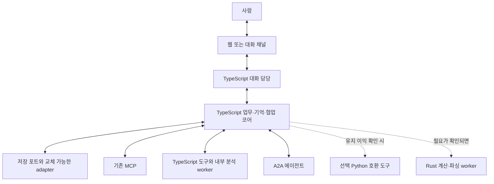

# 구현 언어와 전환 전략

2026-09-05 · v0.11 설계 권고 · 처음부터 만드는 안·저장소 독립성 · 구현/성능 측정 전

## 1. 권고

**새 제품의 필수 애플리케이션 런타임을 Python 없이 TypeScript + 지원 중인 Node.js LTS로 구성하는 안을 우선 비교 기준으로 권고한다.** 코어·사람 대화·기억·협업·새 도구를 TS로 설계하고, Rust와 기존 Python 도구의 도입은 각각 이익이 확인될 때 선택한다.

사용자는 처음부터 만든다고 생각하면 Python 없는 새 구현이 더 좋을 수 있으므로 고려하라고 요청했다. 아직 Python 유지/제거를 확정한 것은 아니다. v0.3의 ‘기존 Python 도구를 유지’하는 기본 전제를 풀고, 재사용 비용과 신규 구현 비용을 비교한다. 기존 코드의 양이나 기존 TS UI가 언어 선택을 결정하지 않게 한다.

선택 기준은 디버깅, 비동기 도구/모델 호출, 상태·메시지 계약, 지속형 workflow 지원, 필요한 기능의 개발·운영 총비용이다. 장기 추론의 정확성은 업무 상태·기억·증거·평가 설계로 확보해야 한다. 언어 성능으로 모델의 판단 품질을 보장하지 않는다.

### 처음부터 만든다는 가정에서 비교할 구성

| 구성안 | 이점 | 비용·확인할 점 | 현재 위치 |
|---|---|---|---|
| TS+Node로 제품 코어·도구 통일 | 애플리케이션 언어·계약·디버깅·배포 경로를 줄일 여지 | 필요한 Python 전용 라이브러리의 대체 가능성, 누락된 업무 예외 검증 | 우선 비교 기준안 |
| TS 코어 + Rust 도구/worker | TS의 업무 구현과 별도 자원 요구를 함께 다룸 | 두 toolchain·통신·배포·관측 비용, 실제 개선 측정 | 요구가 입증된 부분에 선택 |
| TS 코어 + 기존 Python 도구 | 복잡한 연동과 검증된 라이브러리 구현을 유지 | wrapper·의존성 패치·배포·오류 추적·운영 인수 비용 | 재사용 이익이 확인된 경우 |
| Rust 중심 백엔드 + TS 웹 UI | 타입·자원 제어를 백엔드 전체에 적용 가능 | 팀 숙련도, SDK 기능, async 진단, 잦은 업무 수정 비용을 검증 | 동등한 대안. 낮은 자원 한도나 팀 역량이 뒷받침되면 재평가 |

위 이점과 비용은 설계 가설이다. TS나 Rust로 바꾸면 자동으로 개발 속도·성능·안전성이 좋아진다는 측정 결과는 아직 없다. 첫 비교에는 기존 구현의 제약을 제거한 최소 제품 요구를 사용한다. 필요한 기능은 일부일 수 있으므로 아카이브 전체를 새 언어로 옮기는 작업량을 목표로 삼지 않는다.

## 2. 언어별 비교

아래는 이 프로젝트에 대한 설계 판단이며 벤치마크 결과가 아니다.

| 항목 | TypeScript / Node.js | Rust | 기존 Python |
|---|---|---|---|
| 상태·메시지 계약 | union/타입 검사와 JSON schema 검증을 함께 사용하기 좋음 | enum/Result/소유권으로 강한 컴파일 시점 제약 가능 | Pydantic·타입 검사 활용 가능, 기존 계약 자산 보유 |
| 대화 스트리밍·UI 연결 | 기존 React/TS 계약과 언어 공유 | 웹 UI와 별도 언어 경계 필요 | 기존 UI와 별도 언어 경계 필요 |
| 도구·모델 연결 | MCP·workflow SDK를 활용하는 코어 후보 | 필요한 SDK·비동기 실행·배포 환경을 별도 적합성 평가 | 기존 도구 및 사내 연동 보존 가치 큼 |
| 디버깅 | Inspector, source map, IDE breakpoint, async trace 구성 | 컴파일 검사·native debugger·tracing, async task 진단 설계 필요 | 익숙한 stack trace와 기존 테스트 자산 활용 |
| 자원 제어·CPU 집약 작업 | event loop를 막지 않도록 별도 worker/process 필요 | 메모리·처리량 요구가 있는 native worker 후보 | 기존 라이브러리의 성능·대체 비용을 측정 |
| 이번 권고 | 코어와 신규 도구를 포함한 제품 주언어 후보 | 필요가 입증된 부분 또는 별도 코어 대안 | 유지 이익을 입증한 경우에 선택 |

Go는 아카이브의 Kubernetes operator에서 이미 사용된다. 이번 에이전트 언어 전환만을 이유로 operator를 다시 작성하지 않는다.

TypeScript의 타입 표기는 실행 때 제거된다. 외부 MCP/A2A 결과·모델 JSON·저장 이벤트는 런타임 schema 검증이 필요하다. Rust의 메모리 안전성도 권한·기밀 전송·업무 중복을 자동 해결하지 않는다. [TypeScript 공식 문서](https://www.typescriptlang.org/docs/handbook/2/basic-types.html), [Rust 동시성 설명](https://doc.rust-lang.org/book/ch16-00-concurrency.html)

## 3. 신규 설계의 선택 근거와 기존 자산

TS 권고는 대화·도구 I/O와 자주 바뀌는 업무 계약을 개발·진단하기에 적합한지 검증하자는 판단이다. Node의 디버깅, 공식 MCP SDK, TypeScript workflow SDK가 후보 도구를 제공한다. 기존 TS 코드가 없어도 이 기준으로 평가할 수 있다. [Node 디버깅](https://nodejs.org/learn/getting-started/debugging), [MCP SDK](https://modelcontextprotocol.io/docs/sdk), [Temporal TypeScript](https://docs.temporal.io/develop/typescript)

직접 확인한 아카이브:

- [web/package.json](/Users/seunghanee/Documents/secumon/extracted/digisecu-employee/web/package.json): React + TypeScript, 기존 UI 재사용 지점.
- [control-plane/package.json](/Users/seunghanee/Documents/secumon/extracted/digisecu-employee/control-plane/package.json): Express/TypeScript, PostgreSQL/Drizzle, Zod, tsc 검사 명령.
- [contracts/package.json](/Users/seunghanee/Documents/secumon/extracted/digisecu-employee/contracts/package.json): TypeScript + Zod 공유 계약.
- `secu-agent`, `secu-agent-skill`: Python 엔진·도구·도메인 자산.

현재 package.json의 버전은 보관된 스냅샷이다. 새 구현에는 사용할 SDK와 호환되는 Node LTS·TypeScript 버전을 선택해 lockfile로 고정한다. Node가 TS 구문을 실행하거나 tsx가 동작하는 것과 타입 검사 성공을 구분해 CI에서 명시적으로 검사한다.

Node는 Inspector 기반 디버깅과 프로파일링을 제공한다. 대화 UI부터 업무 상태까지 TS로 연결하면 한 업무의 타입과 trace를 따라가기 쉬워질 것으로 판단한다. 이것은 저장소 구성에서 도출한 권고이며 실제 문제 해결 시간 단축은 P1에서 측정한다. [Node 디버깅 문서](https://nodejs.org/learn/getting-started/debugging)

## 4. 언어 경계

사용자 확인 요구: 에이전트 본체는 PostgreSQL에 구애받지 않는다. 아래 저장 연결은 업무 의미의 포트이며 SQL/ORM/DB 연결과 제품별 동작은 바깥 adapter에 둔다. 배포에서 구현을 주입하고 동일 계약 시험으로 교체 가능성을 검증한다. [저장소 독립성 상세](/Users/seunghanee/Documents/secumon/design/16-storage-and-recovery.md)

기존 MCP가 Python으로 구현되었어도 소비자인 TS 코어와 같은 언어일 필요가 없다. 이미 독립 운영되는 MCP는 계약과 운영 비용을 확인해 연결할 수 있다. 아직 Python 내부 함수인 도구는 TS 재구현과 Python 서비스화를 비교하며 자동으로 wrapper부터 만들지 않는다. MCP는 로컬 프로세스와 원격 서버를 모두 연결할 수 있다. [MCP 아키텍처](https://modelcontextprotocol.io/docs/learn/architecture)

프로세스가 나뉘면 메시지 framing·요청 ID·timeout·취소·정상/오류 스키마를 명시하고 로그 채널을 분리한다. 원문이 조정/대화 코어로 올라와서는 안 되는 배치라면 내부 분석 worker가 허용된 파생 결과만 반환한다. 모두 TS로 작성해도 별도 자격증명·프로세스·네트워크의 정보 경계는 유지한다. 언어 통일은 한 프로세스에 모든 권한을 합치는 결정이 아니다.

네이티브 FFI로 두 언어의 객체를 처음부터 공유하지 않는다. 필요한 경우 프로세스/네트워크 경계로 장애·권한·배포 수명을 분리하고, IPC 오버헤드가 입증되면 FFI/Rust 통합을 다시 평가한다.

### ‘Python 없음’의 확인 범위

- **새 제품의 실행 의존성 없음:** 코어·게이트웨이·내장 도구·worker·필수 sidecar를 실행할 때 Python이 필요하지 않음. TS가 필수 Python subprocess를 실행하면 이 기준을 충족하지 않는다.
- **기존 외부 MCP 사용:** 서버의 언어와 별개로 새 제품은 프로토콜로 접속 가능하다. 같은 팀이 운영하는 Python 서버라면 운영 부담은 총비용에 계속 포함한다. 원격으로 옮겼다고 비용이 사라지는 것으로 계산하지 않는다.
- **빌드/개발 환경과 전사 시스템:** 제품 실행 의존성과 별도 범위다. 전이적 빌드 도구나 기존 전사 서버까지 Python이 없다는 보장은 하지 않는다. 그 범위까지 원하면 의존성 목록으로 별도 평가한다.

사용자가 언급한 SIEM/EDR MCP는 언어·배포 방식·운영 주체가 미확인이다. 기존 MCP 사용 가능성을 보존하면서도 새 제품의 Python 필수 의존성을 없앨 수 있는지 P0에서 확인한다.

## 5. 유지·포팅·선택 도입

| 구성 | 권고 |
|---|---|
| 목표/작업/시도/예산·기억·게시판·역할·대화·새 도구 | TypeScript로 필요한 기능부터 새 계약 구현 |
| 기존 Python 도구·파서·탐지·보고 생성 | TS 재구현/독립 서비스 유지/외부 MCP 대체/현재 범위 제외를 개별 비교 |
| 기존 Python engine/Ralph/GuardedHarness | 동작·가드·평가 사례의 참고. 새 제품의 실행 필수 의존성으로 두지 않음 |
| core의 유용한 가드·결과 의미·복구 요구 | Python 코드 줄 단위 번역 대신 TS 계약과 회귀 시나리오로 이행 |
| Rust | 프로파일링에서 CPU/메모리/꼬리 지연 문제가 확인되거나 명시 자원 요구가 있을 때 별도 worker로 도입 |
| 기존 TS UI/control-plane와 Go operator | 적합한 자산은 활용하되 필수 전제는 아님. 기존 배포 경로에 Python gateway가 필요한지도 점검 |

**목표·재개·예산·협업·완료의 정본 소유자는 새 코어**로 한다. Python 호환 도구를 선택하더라도 제한된 작업 범위만 맡는다. 같은 업무를 신구 시스템이 동시에 배정하지 않는다.

재사용에는 네 가지가 있다. 실행 코드, 입출력 계약, 업무 규칙·지식, 검증 자료다. 실행 코드를 교체해도 나머지는 남길 수 있다. 기존 출력은 정답으로 자동 채택하지 않는다. 기존 구현의 버그·누락·권한 위반을 재현하는 호환성은 요구하지 않으며, 승인된 업무 요구와 근거로 새 기대 결과를 정한다.

도구별 의사결정에는 필요한 기능, 언어 전용 라이브러리, 숨은 연동 예외, 구현 결합도, 배포 소유자, 검증 자료를 기록한다. 다음 총비용을 같은 검토 기간에서 비교한다. 과거 개발에 이미 쓴 비용은 비교 항목에 더하지 않는다.

- 유지안: 분리·wrapper 구현 + 통합 검증 + 이중 런타임 운영·패치·디버깅 + 필요 시 향후 교체.
- 재구현안: 새 구현 + 의미·권한·경계 검증 + 전환 비용 + 새 런타임 운영.

정확한 금액·기간은 아직 추정하지 않는다. 단순 조회/변환, 상태·오류가 많은 연동, 특정 라이브러리에 의존하는 처리 중 실제 필요한 대표 기능을 골라 작은 비교 실험을 한다. 재작성 코드 줄 수보다 요구 충족·회귀 발견·진단 시간·운영 복잡도를 본다.

## 6. 디버깅을 설계 요건으로

- `work_id/task_id/attempt_id/conversation_id/message_id/trace_id`를 연결한다.
- 모델 요청, 도구 요청, 대기, retry, 상태 변경에 structured event를 남기고 언어 경계를 넘어 trace를 전달한다.
- 재현에는 비식별 fixture와 저장된 도구/모델 응답을 사용한다. 디버깅 replay가 실제 외부 효과나 모델 재호출을 만들지 않도록 한다.
- 상태는 discriminated union과 명시 transition으로 관리한다. strict TS 설정·누락된 분기 검사·런타임 schema 검증을 함께 둔다.
- 비동기 작업의 소유자·기한·취소 상태·예산을 추적한다. Promise가 만들어졌다고 durable 작업이 생긴 것으로 간주하지 않는다.
- 같은 thread의 JS라도 await 사이에 상태 경합이 가능하므로 DB 트랜잭션·버전 검사·중복 제거를 유지한다.
- trace·로그에는 목적지에 허용된 정보만 남긴다. 대화 담당자가 볼 수 있는 진척과 내부 원문을 분리한다.

JSON 계약은 한 원본 schema로 버전 관리하고 연결 경계마다 검증한다. DB의 큰 정수 ID는 JSON 문자열 등 손실 없는 표현을 사용한다. nullable/필드 없음, timestamp, 오류 enum, 부분 결과, byte content의 의미를 일치시킨다. 여러 언어를 선택한 경우에도 Zod/Pydantic/Serde에 서로 다른 정본을 손으로 유지하지 않는다. TS 단일 언어여도 네트워크·저장소·모델 출력의 실행 시 검증은 필요하다.

## 7. Rust를 도입할 때의 기준

에이전트의 지연을 모델/네트워크 대기, 큐 대기, 로컬 CPU, DB, 직렬화로 나누어 측정한다. 로컬 계산 비용이 중요한 경우 Rust를 후보로 삼는다. 예시는 대량 자료의 정규화·파싱·집계이며, 기능 존재 여부나 요구 수치는 아직 확정하지 않는다.

먼저 기존 결과와의 계약/의미 동등성, p50/p95 지연, CPU, peak memory, crash/cancel 처리를 비교한다. 별도 언어의 빌드·배포·관측 비용까지 고려한다. 첫 릴리스에 Rust를 꼭 넣을 필요는 없다.

Node의 worker threads는 CPU 집약 JavaScript 작업에 적합한 수단이며, 일반 비동기 I/O를 자동으로 더 빠르게 만드는 방식은 아니다. 이를 포함해 가장 작은 변경으로 병목이 해소되는지 평가한다. [Node worker threads](https://nodejs.org/api/worker_threads.html)

## 8. workflow와 SDK 선택

- TypeScript 코어에서도 저장 포트 기반 작은 실행 관리자, LangGraph JavaScript/TypeScript, Temporal TypeScript를 비교할 수 있다. 장기 업무의 복구·취소·대기 시나리오로 하나의 소유 방식을 선택하고 구체 저장 동작은 adapter로 연결한다. [LangGraph JS persistence](https://docs.langchain.com/oss/javascript/langgraph/persistence), [Temporal TypeScript](https://docs.temporal.io/develop/typescript)
- Temporal을 선택하면 workflow 안의 결정적 진행과 외부 LLM/도구 작업을 분리한다. 저장 이력으로 replay하며 외부 호출은 activity 등의 명시 작업 경계에 둔다.
- MCP는 공식 TypeScript·Rust SDK가 모두 있다. 기능 지원·성숙도·기존 서버 버전을 확인해 사용할 버전을 고정한다. 언어 전환과 모든 사내 MCP의 프로토콜 업그레이드를 한 번에 묶지 않는다. [MCP SDK 목록](https://modelcontextprotocol.io/docs/sdk)
- A2A도 기존 상대 구현과의 버전·인증·작업 상태 계약을 확인한다. 언어의 타입만으로 상대 결과를 신뢰하지 않는다.

이 문서는 SDK 설치나 신규 런타임 구축 결과가 아니다. 공개 공식 문서 확인과 현재 저장소 구조에 기초한 설계 권고다.
