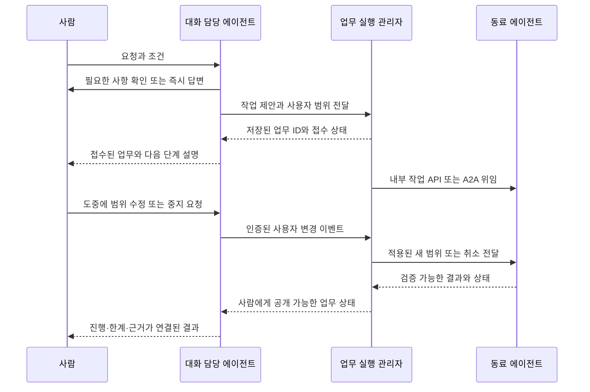

# 사람과 대화하는 에이전트

2026-09-05 · v0.6 · 사람 대화 역할과 CLI/Web/Knox 연결

## 1. 역할

**영업 에이전트는 실제 사람과 소통하는 대화 담당 에이전트다.** 사용자의 요청을 이해하고 필요한 내용을 확인하며, 내부 동료나 A2A로 연결된 에이전트와 협업하고, 진행·차단 사유·결과를 사람에게 설명한다. 이 역할은 보안·연구·일반 업무에 공통으로 사용할 수 있다.

기존 문서의 고객/제안서 중심 예시는 이 정의로 교체했다. 영업이라는 단어 때문에 상업적 영업 도메인이나 고객 스키마를 코어에 요구하지 않는다.

대화 담당도 같은 범용 런타임을 사용하는 에이전트다. UI/채널 adapter는 입력·스트리밍·인증을 맡고, 대화 담당은 해석·설명·협업을 맡으며, 업무 실행 관리자는 정본 상태와 실제 진행을 맡는다. 한 역할이 여러 책임을 무제한 소유하지 않는다.

## 2. 사람 ↔ 대화 담당 ↔ 내부 협업

단순한 설명·이미 허용된 결과 조회는 대화에서 바로 답할 수 있다. 장기 실행·협업·외부 효과가 필요한 요청은 업무 계약으로 승격한다. 위 그림은 역할 간 논리 흐름이다. 채널의 접수 처리는 전체 모델 해석·계획을 기다리지 않고 인증·중복 확인 후 요청과 접수 상태를 먼저 저장한다. 저장된 ID에 근거한 짧은 접수 문구를 템플릿으로 전달할 수 있으며, 목표가 모호하면 “요청 접수”와 “내용 확인이 끝난 업무 수락”을 구분한다. 스트리밍 도중 나온 모델 산문을 작업 완료로 표시하지 않는다.

## 3. 대화와 업무의 수명

`conversation_id`는 사람과의 대화, `work_id`는 진행하는 업무다. 한 대화에서 여러 업무를 다룰 수 있고, 권한이 있는 새 대화에서 기존 업무를 이어받을 수 있다. 연결 관계를 명시적으로 저장한다.

- 창 닫기/네트워크 단절은 업무 취소로 자동 해석하지 않는다.
- 사람의 명시적인 pause/cancel/범위 변경은 별도 이벤트로 처리한다.
- 재접속 시 마지막 전달 이벤트 cursor와 업무 상태를 복원한다.
- 같은 메시지가 재전송되어도 새로운 업무를 중복 생성하지 않는다.
- 대화의 응답이 끝나도 장기 업무는 실행/대기 상태로 남을 수 있다.
- 알림은 사용자가 선택한 채널·빈도·권한 범위로 전달한다. 매 내부 이벤트를 사람에게 중계하지 않는다.

취소는 추가 배정 중지, 수행 중 작업의 취소 요청, 실제 종료 확인으로 구분한다. 취소가 불가능하거나 이미 발생한 외부 결과는 그대로 기록한다. “중지 요청을 접수함”과 “모든 실행이 끝남”을 구분해 설명한다.

## 4. 대화 도중 새 지시가 들어오는 경우

대화 담당은 새 메시지가 질문, 현재 업무 수정, 새 업무 중 무엇인지 구분한다. 모호하고 결과에 영향을 주면 확인한다. 해석된 변경은 원문 메시지 ID·사용자 신원·업무 버전과 연결한다.

같은 업무에 대한 변경은 순서와 버전을 검사한다. 이미 취소되거나 범위가 바뀐 업무에 늦게 온 worker 결과는 자동 적용하지 않는다. 결과는 이력에 보존하고 새 상태에 유효한지 검증한다. 중요한 승인에는 내용·범위·기한이 연결되어야 하며 대화 담당이 사용자 승인을 대신 만들어내지 않는다.

## 5. 사람에게 보여줄 정보

사람의 목적에 맞게 현재 상태, 최근 확인 사실, 아직 모르는 점, 추가 입력이 필요한 이유, 결과 근거를 설명한다. 검토원별 내부 대화나 전체 자료를 모두 노출할 필요는 없다.

공개 가능한 진행 상태는 실제 작업 이벤트에서 가져온다. 모델이 진행 중인 것처럼 말하는 산문과 관측된 실행을 구분한다. 대화 담당은 자료·업무별 권한에 따른 view를 사용하며, 담당 사람에게 허용되지 않은 내부 자료가 대화 요약을 통해 새어 나오지 않게 한다.

내부 agent 메시지·MCP 결과·첨부 문서는 사용자 승인 이벤트가 아니다. 출처와 인증된 채널 권한을 유지한다. 사람과 접한다는 이유만으로 대화 담당에게 모든 도구·모든 원문 권한을 부여하지 않는다.

## 6. 범용성 평가 예시

- 사람의 “두 공개 문서를 비교하고 근거를 정리해 줘”라는 요청을 접수해 동료에게 분석을 맡긴다.
- 분석 중 “비용 항목은 빼고 운영 제약을 더 봐 줘”라는 수정이 들어온다.
- 사람이 창을 닫고 다시 접속해도 같은 업무 상태를 복원한다.
- 동료 응답이 늦게 오거나 중복 도착해도 결과를 한 번만 적용한다.
- 최종 결과는 수정된 요청과 검증된 근거에 맞춰 설명한다.

이 예시는 상업적 영업 도메인을 만들기 위한 요구가 아니다. 비보안 업무와 사람의 중간 개입도 같은 코어가 다룬다는 시험이다. 서브넷 공동 조사 예제는 별도의 업무 모듈로 유지한다.

## 7. 먼저 확인할 품질

첫 응답/접수 지연, 진행 조회 지연, 수정·중지 적용 시점, 재접속 복원, 중복 메시지 방지, 사용자별 권한, 결과와 실행 상태의 일치를 측정한다. 사용자 지정 채널은 CLI·Web·사내 Knox Messenger다. Knox MCP는 별도 구현되어 있다는 사용자 설명을 기준으로 재사용하며, 실제 입출력·수정·스레드·버튼·전달 확인 기능은 아직 확인하지 않았다.

첫 수직 시제품부터 최소 대화 입력·진행 조회·중지/수정 경로를 넣는다. 게시판과 다수 에이전트가 완성된 뒤에 대화를 붙이는 순서로 미루지 않는다.

## 8. 채팅 표시와 답변 전달

기본 흐름은 **접수 안내 → 같은 업무의 상태 갱신 → 최종 답변**이다. 질문·의미 있는 변화·실패/취소 확인만 필요에 따라 새 메시지로 보낸다. 도구 호출, 내부 협업, compact, 평범한 재시도를 각각 말풍선으로 만들지 않는다. 웹은 업무 카드와 상세 보기, CLI는 상태 줄과 명시적 상세 조회, Knox는 짧은 텍스트 접수·결과를 먼저 구현한다. 내부 역할이 여러 명이어도 기본 대화 화자는 하나다.

코어의 커밋된 사건을 공개 상태로 투영하고, 응답 정책이 새 메시지·상태 갱신·알림 생략을 선택한다. 답변 전달 장부는 대상 채널·업무/목표 버전·메시지 ID·시도·전달 상태를 관리한다. 매 사건마다 LLM을 호출하지 않는다.

`result_ready`는 검증된 결과가 준비됐음을 나타내며 최종 답변 전달을 시작할 수 있다. 업무 목표에 전달 의무가 있으면 실제 요구 수준의 전달 확인 후 완료한다. “완료해야 보냄”과 “보내야 완료함”의 순환 의존성을 만들지 않는다. 분석 완료·메신저 API 수락·전달·사람의 읽음은 별개이며, 전달 실패만으로 분석을 반복하지 않는다.

채널별 예시, 다중 업무 연결, 단체방 수신 권한, 알림 합치기와 검증 순서는 [채팅과 채널 설계](/Users/seunghanee/Documents/secumon/design/10-chat-and-channels.md)에 정리했다.
