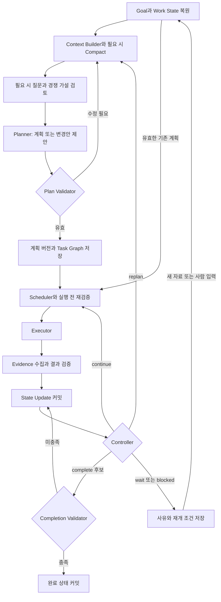

# 롱 호라이즌 메인 코어 프레임워크

2026-09-05 · v0.12 논의용 설계 · 실행 의미·컨텍스트·저장/복구·완료와 전달 · 구현 전

## 1. 설계 범위와 현재 수준

**목표·실행 상태와 가설·근거 상태를 유지하면서, 필요한 계획을 검증·실행하고 새 증거에 따라 계속 진행·재계획·완료를 판단하는 코어를 설계한다.** goal/state, hypotheses, planner, plan validator, task graph, executor, evidence, state update, controller, context builder/compact가 여기에 포함된다. 사용자가 열거한 순서를 매번 전부 실행하는 고정 파이프라인으로 두지 않는다.

v0.4에는 목표·기억·증거·복구·압축·완료 원칙이 있었지만 planner/validator의 책임, 계획 그래프 버전과 제어 분기는 여러 절에 흩어져 있었다. 이 문서는 그 연결과 불변 조건을 구체화한다. 확정된 TS 타입·DB 스키마·실행 코드·성능 검증 결과는 아직 아니다.

각 상자는 논리적 책임이다. 각각 별도 LLM 에이전트나 서비스를 하나씩 만드는 구조를 뜻하지 않는다. 하나의 TS 코어 안에서 모듈/함수로 구현할 수 있고, 원문 권한이나 장애 격리가 필요한 실행만 분리한다. Python 없는 TS 제품을 비교 기준으로 둔 v0.4의 언어 대안은 유지한다.

## 2. 메인 루프

그림의 가설·계획 저장·상태 전이·완료 커밋은 모두 동일한 상태 갱신 규칙을 거친다. 사용자 변경·취소·새 근거 이벤트도 출처 검증 후 상태 갱신 경로로 들어온다. 그림에서 생략한 취소/일시중지/실패 경로는 8절의 전이 규칙을 따른다. State Update는 새 근거가 기존 가설·계획의 어느 부분에 영향을 주는지도 기록한다.

Context Builder는 그림의 Planner뿐 아니라 **모든 LLM 호출 직전**에 적용한다. 실행 중 추론, 의미 검토, 완료 검토, 대화 응답도 현재 역할과 목적에 맞는 컨텍스트를 사용한다. 같은 상태의 유효한 패킷은 재사용할 수 있으며 매 단계마다 요약 LLM을 호출하지 않는다.

유효한 계획과 실행 가능한 작업이 있으면 `continue`로 진행한다. 매 도구 호출마다 planner와 별도 검토 모델을 모두 다시 호출하는 구조를 기본으로 하지 않는다. 계획 수정 반복에도 상위 업무의 시간·토큰·횟수 예산을 적용한다.

이 그림은 조사·다단계 업무의 경로다. 경량 업무는 필요한 상태/제약 → 직접 조회 또는 단일 작업 계약 → 실행 전 검사 → 결과 검사·저장 → 답변으로 처리할 수 있다. 별도 planner/가설/critic 호출과 그래프 확장을 강제하지 않는다. 실행 정책은 사용자 모드·업무 특성·예산을 보고 이 경로와 필요한 탐색 수준을 선택한다. 지속 실행 여부와 모델 한 번의 추론 자원은 별도 제어다. [모드와 전환 계약](/Users/seunghanee/Documents/secumon/design/11-execution-modes.md)

## 3. 구성요소의 책임과 입출력

다음은 필요한 계약의 개념이며 최종 필드명은 후속 스키마 설계에서 정한다.

| 구성요소 | 입력 | 출력과 책임 |
|---|---|---|
| Goal / Work State | 인증된 목표·수정, 커밋된 이벤트 | 목표 버전, 완료 기준, 제약, 계획 버전, 작업 상태·의무·예산·대기 조건의 정본과 인식 상태 참조 |
| Execution Policy | 사용자 모드·업무 계약·현재 근거·예산·지속 조건 | 경량/다단계/적응적 조사 선택과 전환 제안. 명시 제약 안에서 적용하며 상태·누적 비용·필수 검증 보존 |
| Epistemic State / Hypothesis Manager | 질문, 관찰, 가정, 기존 설명, 지지·반증 근거 | 경쟁 가설·판별 질문·모순·알지 못하는 범위. 모델은 변경안을 내고 State Updater가 출처·버전과 함께 반영 |
| Context Builder / Compactor | 상태 버전, 목적, 역할 권한, 관련 근거, 모델 예산 | 출처·버전·상세 조회 참조가 있는 제한된 컨텍스트. 정본 변경 권한 없음 |
| Planner | 목표, 실행·가설 상태, 기존 계획, 판별 질문, 사용 가능한 capability | 기반 상태/목표 버전이 붙은 PlanProposal 또는 PlanPatch, 변경 이유와 기대 결과 |
| Plan Validator | 제안, 현재 상태, 정책, 도구 계약 | accept / needs_revision / blocked와 구조화된 이유. 검증 전 계획은 실행 불가 |
| Task Graph | 검증된 계획과 변경안 | 작업·의존성·입력/산출물 연결·수락 기준·담당 범위와 계획 이력 |
| Scheduler | 현재 그래프, 유효한 선행 산출물, 예산·권한·실행 자원 | 실행 가능한 작업의 선택, 소유권/lease, 실행 의도·예산 예약 |
| Executor | 특정 task/attempt의 제한된 실행 계약 | 실행 상태, 결과·근거 참조, 비용, 관측 범위, 재시도·취소 정보 |
| Evidence Intake / Result Validator | 도구/동료 응답과 실제 자료 | 출처·시점·버전·범위가 있는 근거, 검증 결과, 미확인 사항. 실행 성공과 업무 충족을 구분 |
| State Updater | 검증된 결과/계획/사용자 이벤트, 기대 상태 버전 | 사건 이력과 새로운 Work State, 작업 상태·주장 관계·예산·후속 이벤트의 일관된 커밋 |
| Controller | 커밋된 최신 상태와 진전·제약 평가 | continue / replan / complete 후보 / wait / blocked / pause / cancel / fail과 이유 |
| Completion Validator | 현재 목표의 완료 기준과 근거·의무 | 충족 여부와 근거, 누락된 요구. 완료 후보를 실제 완료로 확정할 조건 제공 |

에이전트 메모리와 Work State도 구분한다. 업무 진행의 정본은 Work State이고, 여러 업무에서 얻은 경험·조직 지식은 근거와 적용 범위를 가진 별도 기억이다. 새 업무가 과거 기억을 조회할 수 있지만 과거 결론을 현재 사실로 자동 확정하지 않는다.

Planner는 다음 행동의 의미와 순서를 제안하고 Scheduler는 실행 가능성을 판단한다. Executor는 주어진 범위 안에서 세부 도구 선택을 할 수 있지만 최상위 목표·권한·전체 예산·완료 기준을 임의 변경하지 않는다. 추가 작업이 필요하면 변경안으로 제출한다.

컴퓨터 유즈 작업은 여기에 화면/세션 소유권, 관측 버전·대상 검증, 짧은 조건부 행동 구간과 사후 조건을 연결한다. 도구 한 번 안의 단계도 부분 결과·효과·기한을 관리한다. UI 입력 전달은 업무 완료 증거와 구분하며 재시작/compact 후에는 실제 화면을 재검증한다. 상세는 [컴퓨터 유즈 도구 계약](/Users/seunghanee/Documents/secumon/design/12-computer-use-tools.md)에 둔다.

## 4. 가설과 추론 상태

Work State에는 실행 상태와 인식 상태를 연결하되 의미를 구분한다. ‘조회 작업 성공’은 실행 사실이고 ‘문서 A의 설명이 현재도 적용된다’는 검토할 주장이다. 도구 호출 횟수·완료 작업 수만 늘어나는 것을 추론의 진전으로 보지 않는다.

| 개념 | 남길 내용 |
|---|---|
| Question | 목표와 연결된 열린 질문, 답이 필요한 이유, 답할 수 있는 범위 |
| Observation | 실제로 얻은 자료/관측, 출처·시점·범위와 원문 참조 |
| Assumption | 아직 확인하지 못했지만 계획이나 해석이 의존하는 전제 |
| Hypothesis | 질문에 대한 잠정 설명, 적용 조건·범위, 이 설명이 맞으면 관측될 것과 틀렸다고 판단할 조건 |
| Evidence relation | 어느 가설을 어떤 이유로 지지/반박/제한하는지, 원본 계보·버전·관련성 |
| Assessment | 현재 판단과 이유, 중요한 지지·반증, 미확인 범위, 다음 판별 질문 |

### 필요할 때 사용하는 가설 검토 루프

1. 목표와 관찰에서 설명이 필요한 질문을 고른다. 이미 정해진 문서 변환 같은 업무는 가설 탐색을 생략할 수 있다.
2. 현재 설명과 의미 있는 경쟁 설명을 생성한다. 기존 가정이 틀렸거나 자료가 불완전한 경우도 고려하되 가능한 모든 설명을 무한 생성하지 않는다.
3. 각 가설이 예측하는 관찰과 반박될 조건을 구체화한다. 검증할 수 없는 설명은 한계나 열린 질문으로 남긴다.
4. 가설 사이에서 결과가 달라질 판별 질문을 고른다. 목표 관련성, 판별 가능성, 비용·지연·권한으로 조회·검토 작업을 제안한다. 정보 이득은 초기에는 판단 근거를 명시하는 휴리스틱이며 보정된 확률 계산이라고 주장하지 않는다.
5. Planner가 그 질문을 실제 task와 산출물 수락 기준으로 바꾼다. Plan Validator를 통과한 작업만 수행한다.
6. 새 근거를 원래 예측과 비교해 지지·반증·범위 제한을 제안하고 State Updater를 통해 반영한다. 예상 밖 관찰은 새 질문이나 새 가설의 이유가 될 수 있다.
7. Controller가 가설 평가와 계획의 영향 범위를 읽는다. 현재 계획으로 남은 질문을 답할 수 있으면 continue, 계획 가정이 깨지면 replan, 응답을 기다리면 wait, 목표 기준이 충족되면 완료 검토로 간다.

Hypothesis Manager를 별도의 상주 탐정 에이전트로 구현할 필요는 없다. Planner와 같은 모델 호출에서 가설·계획 변경을 함께 제안할 수도 있다. 다만 각 제안은 가설 상태 변경과 실행 계획 변경으로 구분해서 기록하고 검증한다. 복잡한 업무에서만 독립 검토 역할을 추가할 수 있다.

### 가설을 사실로 오인하지 않는 규칙

- 생성·지지·반증·재평가·대체의 이력을 보존한다. 적용 범위를 벗어났다는 것과 반박됐다는 것은 구분한다.
- 지지와 반증이 동시에 존재할 수 있다. 하나의 confidence 숫자로 모순과 미관측 범위를 감추지 않는다. 확률 점수는 평가·보정 체계를 갖추기 전까지 필수로 두지 않는다.
- 같은 원본을 여러 에이전트가 인용한 것은 새로운 독립 근거가 아니다. 요약과 반복 동의도 독립 증거로 세지 않는다.
- 근거를 못 찾은 이유가 권한/검색 오류/불완전 수집이면 반증과 구분한다. ‘없음’이 반증이 되려면 그 범위와 탐지 가능성이 충분한지 검토한다.
- 반증을 찾는 질문을 계획에 포함한다. 반증의 중요도와 다음 판단에 미치는 영향도 저장하며, 현재 설명을 지지하는 자료만 고르지 않는다.
- 수명·자료 버전·사용자 목표가 바뀌면 관련 평가를 다시 확인한다. 완료 작업의 실행 이력은 남기고 현재 판단에 쓰일 수 있는지만 재평가한다.
- 불확실한 상태가 올바른 결론일 수 있다. 가설 하나를 억지로 확정해야만 업무가 끝나는 규칙을 두지 않으며 원래 목표의 완료 기준으로 판단한다.

예를 들어 공개 문서 A/B의 내용이 다르면 H1 ‘적용 조건이 다름’, H2 ‘개정 시점이 다름’, H3 ‘서로 모순됨’을 검토할 수 있다. 다음 작업은 문서를 처음부터 다시 요약하는 대신 적용 범위·개정 이력·해당 문구의 근거를 확인하도록 계획한다. 이는 설명용 예시이며 특정 가설 목록을 코어에 하드코딩하지 않는다.

## 5. 계획과 Task Graph

### 한 번에 미래 전체를 고정하지 않는다

Planner는 전체 목표와 중간 목표를 유지하면서 가까운 실행 구간을 구체화한다. 먼 구간은 필요한 정보와 확장 조건만 기록할 수 있다. 아직 구체화되지 않은 노드는 실행 불가이며, 다음 구간 확장도 검증된 계획 변경으로 취급한다.

작업은 최소한 목적, 입력 참조, 선행 조건, 기대 산출물, 수락 기준, 허용 도구/범위, 비용·기한, 재시도 의미를 가진다. LLM의 자연어 할 일 목록만으로 배정하지 않는다. 독립 작업은 병렬 후보가 되지만 공유 자원·순서·권한 충돌을 먼저 검사한다.

초기 구현의 한 계획 버전에서는 작업 선행 관계를 DAG로 제한하는 안을 권고한다. 이는 구현 복잡도를 줄이기 위한 선택이며 범용 에이전트의 유일한 그래프 형태라는 뜻은 아니다. 반복 조사는 새 작업 또는 계획 버전으로 표현한다. 장기 업무의 제어 상태 그래프에는 `continue/replan` 루프가 있다. **task dependency graph와 코어 control-flow graph는 서로 다른 그래프다.**

가설·근거의 지지/반박 관계도 별도로 관리한다. 이를 task의 실행 선행 조건과 혼동하지 않으며 처음에는 관계형 테이블로 표현할 수 있다. 그래프 DB 도입은 필수 전제가 아니다.

### 부분 재계획

새 반증·사용자 변경으로 기존 가정이 깨지면 영향받는 작업·산출물 의존성을 표시하고 그 부분의 변경안을 만든다. 완료된 시도의 역사와 원문을 삭제하지 않는다. 과거 실행 성공 여부와 현재 목표에서 결과가 유효한지는 별도 속성이다.

PlanPatch는 기반 goal/state/plan 버전, 추가·대체·중단할 작업, 유지할 결과와 근거, 영향 범위, 변경 이유를 가진다. 새로운 상태에 대입해 검증한 뒤 한 계획 버전으로 커밋한다. 진행 중 결과가 늦게 도착하면 시도 기록은 남기되 최신 계획에서 채택 가능한지 재검증한다.

새 계획을 만드는 동안에도 영향받지 않은 작업을 계속할지는 정책으로 결정한다. 목표/권한 변경으로 유효성이 불명확한 작업은 새로운 배정을 멈춘다. 옛 목표를 근거로 실행하던 외부 효과를 이미 취소된 것으로 간주하지 않는다.

## 6. Plan Validator

**실행 가능한 계획인지와 목표를 잘 해결하는 계획인지를 나누어 검사한다.**

코드로 강제할 검사:

- 제안의 schema·ID·기반 버전 일치, 참조 존재와 허용된 그래프 형태.
- 선행 산출물과 후속 입력 계약의 연결, 필수 작업의 실행 가능성.
- 범위·권한·모델 목적지 정책, 실제 등록된 도구/capability 사용 여부.
- 작업 수·위임 깊이·시간·토큰 예산, 요청된 승인과 외부 효과 정책.
- 목표의 필수 완료 기준을 충족하거나 검증할 작업이 계획에 연결되는지.
- 이미 완료된 작업의 근거 없는 반복·대체, 목표/완료 기준의 무단 변경 여부.

도메인 규칙 또는 필요할 때 의미 검토로 평가할 사항:

- 중요한 가정과 대안·반증을 확인할 질문이 있는가.
- 작업을 수행하면 어떤 불확실성이 줄고 완료 판단이 어떻게 가능해지는가.
- 이미 확인한 사실을 불필요하게 반복하거나 불확실한 내용을 사실로 전제하지 않는가.

필수 기준의 연결 존재는 코드로 확인할 수 있지만 실제로 충분한 계획인지는 의미 판단이 필요할 수 있다. LLM 검토 결과는 그 판단의 근거이며 정확성 증명이나 권한 부여가 아니다. 작은 계획은 결정적 규칙으로 빠르게 검사하고, 복잡성·변경 영향에 따라 추가 검토 비용을 쓴다.

검증 실패는 이유와 영향받는 노드를 반환한다. Planner 수정 루프에 제한을 두며 계속 실패하면 사용자 입력·권한·자료 부족으로 대기/차단하거나 정책에 따라 실패 처리한다. 검증을 통과한 계획도 실제 배정 직전에 최신 권한·예산·선행 결과·업무 버전을 Scheduler가 다시 확인한다.

## 7. 실행 → Evidence → State Update

[저장소 계약](/Users/seunghanee/Documents/secumon/design/16-storage-and-recovery.md)은 현재 상태/변경 사건의 동시 커밋, 원본 저장 후 DB 참조, 정본과 검색/캐시의 차이, 큐/외부 엔진 소유권과 복원 후 효과 대조를 구체화한다. 코어가 상태 변경을 검증하며 모델/도구의 제안과 DB의 확정 상태를 구분한다.

1. Scheduler가 작업을 claim하면서 task/attempt ID, 입력 버전, 도구 버전, 실행 의도와 예산 예약을 저장한다.
2. Executor가 제한된 실행을 수행한다. 실제 효과가 불명확하면 unknown을 보고하고 무조건 반복하지 않는다.
3. 응답·자료를 출처·hash/버전·관측시각·관측 범위·정보 등급과 함께 저장한다. 원문과 큰 결과는 별도 저장소에 두고 참조한다.
4. Result Validator가 스키마·출처·범위·최신성·수락 기준을 확인한다. 도구 호출 성공은 자료의 사실성이나 목표 완료를 보장하지 않는다. 관찰과 해석·가설은 나누어 기록한다.
5. State Updater가 기대 버전과 중복 여부를 확인해 이벤트, 작업 상태, 근거 참조·주장/반증 관계, 비용 정산, 후속 전달 의도를 일관되게 커밋한다.
6. Controller가 커밋된 상태를 읽고 다음 진행을 결정한다. 다른 사건의 원문이나 worker의 대화 전체를 무조건 상위 모델에 전달하지 않는다.

원문 저장소와 DB를 원자적으로 묶을 수 없다면 원문을 먼저 내구성 있게 저장하고 참조를 커밋한다. 이 사이 장애로 생긴 미참조 원문은 대조·보존 정책으로 정리하며, 저장되지 않은 원문을 가리키는 완료 상태를 만들지 않는다. DB와 메시지 전송은 outbox·소비자 중복 제거 등의 계약으로 연결한다.

State Updater의 구조적 전이는 코드가 집행한다. LLM이 제안하는 주장·해석도 검증할 입력이며 자유 텍스트로 전체 상태를 덮어쓰지 않는다. 동일 결과 재전달은 같은 사건으로 두 번 적용하지 않는다. 사용자 목표 변경과 결과 반영이 경합하면 최신 버전으로 적합성을 다시 판단한다.

결과 저장 후 상태 반영 전에 종료되면 저장 결과로 반영을 재개한다. 외부 효과가 발생했는지 알 수 없는 경우에는 영수증·멱등키 등 지원되는 대조 수단을 쓰고, 지원되지 않으면 확인 대기로 둔다. 정확히 한 번의 외부 효과를 DB 트랜잭션만으로 보장하지 않는다.

## 8. Controller와 완료 판정

아래는 제어 결정이며 저장되는 업무 상태와 일대일로 같은 enum일 필요는 없다. 예를 들어 `replan`은 업무의 실행 상태를 유지하면서 계획을 교체하는 결정이다.

| 결정 | 조건 | 후속 동작 |
|---|---|---|
| continue | 유효한 계획과 ready 작업, 실행 허용·예산이 있음 | 같은 계획에서 다음 작업 배정 |
| replan | 목표/근거/가정 변경, 필수 결과 미달, 현재 방식의 무진전, 다음 구간 확장 필요 | 영향 범위와 이유를 포함한 PlanPatch 생성·검증 |
| complete 후보 | 현재 목표의 필수 산출물·의무를 충족했다는 근거가 있음 | Completion Validator 통과 후 현재 버전에 완료 커밋 |
| wait | 유효한 실행/외부 응답/자료 도착/예약 시각을 기다림 | 재개 조건·기한·대조 상태 저장, 모델을 계속 실행하지 않음 |
| blocked | 권한·사용자 결정·누락 자료 등 스스로 해소 못 하는 조건 | 사유·필요 입력과 재개 이벤트를 저장하고 알림 정책 적용 |
| pause / cancel | 인증된 사용자 요청 또는 정책상 중단 | 신규 배정 정지, 진행 중 시도 정리, 실제 효과·정리 결과 기록 |
| fail | 회복 불가 오류나 정책이 정의한 최종 실패 | 미완료 의무·오류 근거를 남기고 종료 |

최신 사용자 취소/권한 변경을 먼저 반영하고, 아직 진행 중이거나 결과가 unknown인 작업을 대조한 뒤 완료 가능성과 다음 행동을 평가한다. 예산 소진·빈 큐·모델의 끝났다는 답변은 완료 조건이 아니다. 예산이 부족하면 정책에 따라 대기/차단/실패로 기록한다.

Completion Validator는 현재 goal 버전의 기준별로 산출물과 근거를 연결한다. 중요한 반증·미관측 범위·남은 승인·전달 의무가 처리됐는지 본다. 불확실성을 명시한 보고서 작성이 목표라면 그 조건으로 완료할 수 있지만, 원래 목표를 스스로 낮춰 성공 처리하지 않는다.

산출물 검증을 통과하면 `result_ready`와 전달 의도를 커밋할 수 있다. 답변 전달이 목표의 필수 의무라면 그 요구 수준의 확인 뒤에 최상위 완료를 판정한다. 업무 완료를 전달 시작의 선행 조건으로 강제하지 않아 순환 대기를 피한다. 결과 준비·업무 완료·메신저 API 수락·수신 전달·읽음을 구분하고, 전달 실패 때문에 분석을 다시 실행하지 않는다.

사람에게 보여줄 상태는 커밋된 사건에서 투영하며, 공개 범위와 응답 정책을 통과한 메시지만 채널 outbox로 보낸다. 내부 사건마다 별도 LLM 응답을 생성하지 않는다. 입력·취소·상태 조회에는 긴 분석 작업과 분리된 처리 여력을 두어, 모델 응답이나 알림 backlog가 사용자 제어를 막지 않게 한다. 자세한 채널 계약은 [채팅과 채널 설계](/Users/seunghanee/Documents/secumon/design/10-chat-and-channels.md)를 따른다.

작업 수락 검증, 계획 검증, 최상위 완료 검증은 별개의 책임이다. 완료와 동시에 남은 선택 작업을 정리할 필요가 있으면 그 정책과 상태도 커밋한다. 완료 판단 이후 늦은 결과가 기존 완료 기록을 조용히 덮어쓰지 않게 하고, 중요한 반증은 후속 검토/재개 사건으로 남긴다.

완료 검증이 실패하면 누락된 기준을 상태의 열린 의무로 기록한다. 같은 상태에서 완료 후보만 반복 제출하지 않고 필요한 추가 작업·재계획·대기로 진행한다. 검토 루프의 비용도 상위 업무 예산에 합산한다.

Controller는 규칙과 상태를 바탕으로 결정을 집행하며 판단이 필요한 때만 모델 평가를 요청한다. 결정에는 이유 코드, 근거/누락 참조, 사용한 상태 버전, 다음 재개 조건을 남겨 동작을 설명·재생할 수 있게 한다.

## 9. Compact는 언제, 무엇을 대상으로 하나

**정본을 먼저 저장하고, 그 정본에서 만든 컨텍스트를 교체한다.** compact가 목표·계획·작업 상태·원문을 직접 삭제하거나 재정의하게 하지 않는다. 실제 원문 보존/삭제는 별도의 정보 보존 정책이다.

컨텍스트 구성은 상시 수행하고 compact는 필요할 때 수행한다. 입력 여유 감소, 많은 결과 누적, 관련성 저하, 역할/작업 전환 등을 측정해 발동한다. 단일 고정 토큰 비율을 모든 모델·역할의 정답으로 고정하지 않는다. 시스템·도구 명세·출력/추론 예약과 실제 usage를 예산에 포함한다.

[컨텍스트 수명 정책](/Users/seunghanee/Documents/secumon/design/15-context-lifecycle.md)은 사용이 끝난 도구/skill 명세·예시·원문·화면·반복 설명의 정리를 담당한다. 최근 사용 시점과 함께 현재 의무/계획 의존성·중요도·재조회 가능성을 고려한다. 먼저 규칙 기반 중복 제거·비활성화·저장 후 참조화를 하고 부족할 때 compact한다. 필수 제약·반증·대기/unknown 효과를 보호하며 매번 별도 정리 모델을 호출하지 않는다.

안전한 교체 순서:

1. 사용자 이벤트·완료된 도구 결과·현재 상태를 저장한다. 진행 중 도구는 완료된 것처럼 만들지 않고 task/attempt와 pending 상태를 보존한다.
2. goal/state/plan 버전과 이력 cursor를 고정한 스냅샷을 읽는다.
3. 목표·완료 조건, 제약·권한, 유효한 계획, 미완료 의무·대기, 현재 경쟁 가설·중요 가정·지지와 반증·다음 판별 질문, 근거 ID·범위, 직전 결정과 이유를 필수 패킷으로 만든다. 관련 없는 과거 가설 전체는 이력과 참조로 남긴다.
4. 목적에 맞는 세부 근거·최근 메시지를 추가하고, 큰 도구 결과는 재조회 가능한 참조로 바꾼다. 서술 요약은 필요할 때 생성하는 파생 자료다.
5. 필수 구조·참조 해석 가능성·범위·버전·목적지 정책을 검사한다. 새 사용자 변경 등 관련 버전이 바뀌었으면 변경분을 적용하거나 재생성한다.
6. 검증된 패킷을 게시한 뒤 활성 메시지 창을 교체한다. 마지막으로 검증된 패킷과 원본 이력은 보존 정책 안에서 유지한다.

모델/provider가 요구하는 tool call/result 연결을 유지하고, 미응답 호출을 임의로 지운 history를 재개에 사용하지 않는다. 컨텍스트 안의 자료와 인증된 지시의 출처를 유지하며 요약이 새로운 권한 근거가 되지 않게 한다.

작업자들이 모두 끝날 때까지 기다려야만 compact할 수 있는 것은 아니다. 일관된 스냅샷과 진행 중 작업 ID를 보존하고 늦은 결과를 다음 이벤트로 반영할 수 있어야 한다. 저장/요약 중 종료되면 원문과 커밋된 상태에서 패킷 생성을 다시 시작한다.

요약 실패 시 마지막 패킷에 현재 변경분을 반영하거나 구조화 상태에서 최소 패킷을 재생성한다. 권한과 토큰 한도 안에서 필수 내용을 확보하지 못하면 대기/차단한다. 손상된 패킷으로 진행하거나 요약 실패를 업무 완료로 처리하지 않는다.

구조 검증만으로 자연어 의미 손실을 전부 탐지할 수는 없다. 압축 후 처음의 작은 단서를 다시 찾는지, 반증이 빠져 판단이 달라지는지, 잘못된 완료가 늘어나는지 별도 평가한다. 보존된 원문을 검색하지 못하는 실패도 포함한다. 모델 비공개 사고 원문을 저장하는 방식에는 의존하지 않고 공개 가능한 결정·근거·열린 질문을 남긴다.

## 10. 첫 검증 시나리오

비보안 합성 업무: 공개 문서 A/B의 운영 제약 비교. 처음에는 문서 A가 H1을 뒷받침하지만 B의 각주가 반증하며, 사용자는 도중에 비교 기준을 바꾼다.

| 주입하는 상황 | 기대하는 코어 동작 |
|---|---|
| 입력이 없는 작업·잘못된 의존성·범위 밖 도구를 Planner가 제안 | Plan Validator가 실행 전 거부, 유효 계획을 임의 덮어쓰지 않음 |
| 유효 계획과 독립 자료 읽기 작업이 있음 | Scheduler가 허용된 동시성으로 배정, 불필요한 전체 재계획 생략 |
| 결과를 저장한 직후 프로세스 종료 | 같은 결과 참조로 상태 반영 재개, 중복 효과·이중 정산 방지 |
| B의 반증·사용자 기준 변경 | 관련 주장/산출물 유효성 갱신, 필요한 부분만 재계획 |
| 경쟁 가설이 서로 다른 예측을 만듦 | 반복 요약보다 두 가설을 구분할 근거 조회를 선택하고 선택 이유 기록 |
| 같은 원본의 반복 인용·검색 오류로 자료 없음 | 중복 근거와 관측 불가를 구분, 잘못된 확신·반증으로 승격하지 않음 |
| 단순 변환 또는 이미 답이 확인된 업무 | 불필요한 가설 생성·다중 검토·전면 재계획 없이 진행 |
| 이전 계획의 응답이 늦거나 중복 도착 | 이력은 보존, 최신 상태에 채택 여부 검증, 중복 반영 방지 |
| 핵심 단서를 포함한 초기 대화가 compact로 창에서 빠짐 | 원문과 근거 관계를 재조회해 판단, 미완료 의무 유지 |
| compact 중 새 목표·권한 변경 또는 요약 실패 | 관련 버전/권한 재검사, 최신 패킷 복구 또는 차단 |
| 빈 큐·모든 도구 succeeded지만 필수 비교 항목 누락 | 완료 거부, 추가 계획 또는 사유가 있는 대기/차단 |
| 응답 대기·취소·예산 부족 | 각 상태를 구분, 자동 완료·무한 재계획 방지 |

초기에는 scripted planner/고정 모델 응답으로 상태 전이와 복구를 검증하고, 실제 모델로 계획 타당성·반증 반영·압축 후 판단 품질을 평가한다. 전자는 실행 체계 시험이고 후자는 추론 품질 시험이다. 검증용 TS 도구/fake MCP로 시작하며 실제 사내 시스템 연결은 별도 통합 단계다.

## 11. 프레임워크와의 관계

이 코어 계약은 특정 프레임워크를 채택하기 전에 정의한다. 라이브러리의 workflow graph와 에이전트가 만드는 업무 task graph를 같은 것으로 가정하지 않는다. 저장 엔진을 교체해도 목표·계획 검증·증거 수락·완료 기준·컨텍스트 정책의 의미가 유지되어야 한다.

도구·메모리·skill·방법론을 실제로 선택하고 호출하는 세부 계약은 [호출과 업무 배치 설계](/Users/seunghanee/Documents/secumon/design/09-tools-memory-methods.md)에 둔다. Tool Broker·호출 장부, 직접 근거 조회와 경험 검색, 지침 활성화, 방법론별 역할 배치도 이 코어의 상태·권한·예산·결과 수락 경로를 공유한다.

공식 자료에서 참고한 범위:

- [LangGraph JS persistence](https://docs.langchain.com/oss/javascript/langgraph/persistence): 상태 checkpoint, 중단 후 복구와 이력의 기반 기능. 이 문서의 planner/validator/완료 계약 전체를 자동 제공한다고 보지 않는다.
- [Anthropic context engineering](https://www.anthropic.com/engineering/effective-context-engineering-for-ai-agents): compact·구조화 노트·필요한 자료 재조회 원리. 여기의 버전 검사와 상태 커밋 순서는 이 프로젝트의 제안이다.
- [Anthropic long-running harness](https://www.anthropic.com/engineering/effective-harnesses-for-long-running-agents): 실행 사이 진행 산출물과 완료 검증의 필요성을 보여주는 사례. 특정 구현을 범용 정답으로 채택하지 않는다.

구현 순서는 [통합 플랜](/Users/seunghanee/Documents/secumon/design/03-migration-plan.md)을 따른다. P0-01의 합성 사례에서 P0-02의 최소 Goal/WorkState/EpistemicState/PlanProposal/TaskResult/ControlDecision/ContextPacket·상태 전이·저장 경계를 정하고 P1의 결정적인 루프와 실제 모델로 연결한다. 긴 compact/효율은 P2에서 검증한다. 아직 구현이나 해당 시험 통과를 주장하지 않는다.
