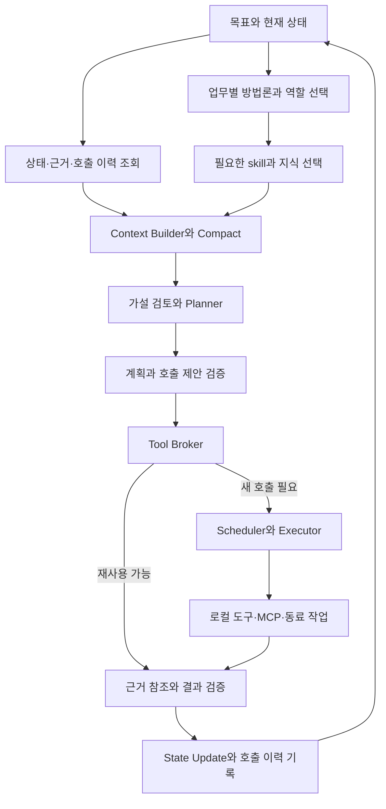

# 도구·메모리·skill 호출과 업무별 방법론

2026-09-05 · v0.9 논의용 설계 · 호출·카탈로그·방법론·실행 정책·컴퓨터 유즈 · 구현 전

## 1. 메인 코어와 연결

**무엇을 할지 계획하는 것과 함께, 무엇을 이미 알고 있는지·무엇을 읽어야 하는지·어떤 도구와 방법을 쓸지를 결정한다.** 도구 호출 효율, 호출 이력 재사용, 메모리 조회, skill 로딩과 업무별 방법론 선택을 [메인 코어](/Users/seunghanee/Documents/secumon/design/08-core-framework.md)에 연결한다.

각 기능은 같은 task/attempt·권한·예산·evidence·state update 계약을 공유한다. 메모리 읽기나 skill 로딩이 별도의 무제한 우회 실행 경로가 되지 않게 한다. 다만 작은 내부 상태 조회까지 모두 새 LLM 호출이나 독립 장기 작업으로 만들지는 않는다.

그림의 조회·지식 선택은 필요에 따라 생략·재사용한다. 재사용 가능성을 planner 이전에 미리 확인할 수 있지만 실제 호출 직전에도 최신성·권한·중복 여부를 확인한다. 도구 대신 동료를 선택한 경우에는 명시적인 작업 수락·책임·기한을 가진 위임 계약을 사용한다.

## 2. 서로 다른 다섯 가지 역할

| 요소 | 역할 | 다른 요소와의 경계 |
|---|---|---|
| Tool | 자료 조회·변환·외부 작업을 수행하는 실행 계약 | 실행이 계획이나 완료의 정본을 임의 변경하지 않음 |
| Memory | 상태·근거·경험·과거 호출을 보존하고 조회 | 과거 결과와 현재 사실, 개인 기록과 공유 지식을 구분 |
| Skill / 지침 | 업무에 필요한 전문 지식·절차·예시 제공 | 읽었다고 실행 권한이나 작업 완료가 생기지 않음 |
| Method / 방법론 | 어떤 순서·검증 방식으로 문제를 풀지 정하는 재사용 전략 | task graph의 후보 구조와 검토 조건을 제공하며 결과를 보장하지 않음 |
| Assignment / 업무 배치 | 역할·범위·능력·권한·예산·모델/worker 배치 연결 | skill 이름 하나로 조직/권한/실행 모델을 모두 결정하지 않음 |

제품의 코어는 SKILL.md 없이도 동작한다. 기존 skill 형식은 유용한 지침을 가져오는 선택 입력이며, 방법론·도구 계약·데이터 정책·완료 검증은 코어의 명시적인 모델로 관리한다.

## 3. Tool 발견·선택·호출

[도구 카탈로그 상세](/Users/seunghanee/Documents/secumon/design/13-tool-catalog.md)는 기존 registry/검색/deferred 구현을 참고해 제공자 목록·권한별 view·작업 후보·활성 명세·호출 장부를 구분한다. 정확한 ID의 빠른 경로, 목록 동기화/폐기, 활성 명세 예산, 후보 분류와 평가를 이 경로에 연결한다. 검색·선택·로딩이 각각 추가 모델 호출이어야 한다는 뜻은 아니다.

### 필요한 도구 명세만 모델에 제공

Tool Registry는 이름·버전·입출력 계약, 제공 기능, 인증/대상 범위, 자료 신선도, 실행 효과, 재시도/취소, batch/pagination, 대략적 비용·관측된 지연을 관리한다. 정적 메타데이터와 실제 운영 지표는 구분하며, 모르는 비용을 0으로 간주하지 않는다.

선택 순서:

1. 주체·조직·목표 범위·정보 등급·실행 환경으로 사용 가능한 도구를 먼저 제한한다.
2. 현재 질문/작업에 맞는 capability 후보를 찾는다. 이름 검색·유형·설명 검색을 함께 사용할 수 있다.
3. 작은 후보 집합의 정확한 입력/출력 명세와 제약만 모델 컨텍스트에 넣는다. 대규모 전체 도구 목록을 매 호출에 넣지 않는다.
4. Planner/Executor가 목적·입력 참조·기대 결과가 있는 호출을 제안하면 실제 registry 버전과 schema로 검증한다.
5. 후보가 적절하지 않거나 명세가 바뀌면 다시 탐색한다. 없는 도구 이름·인자를 추측해 실행하지 않는다.

도구 탐색·명세 조회도 비용과 지연을 관측한다. 권한별 카탈로그 스냅샷을 재사용할 수 있지만 취소된 권한이나 제거된 도구를 캐시 때문에 계속 노출/실행하지 않는다. MCP 버전 차이는 adapter에서 처리하며 특정 명세 버전의 발견 메서드를 코어에 고정하지 않는다.

### 호출 직전 Broker가 확인할 것

- 이 입력에 이미 유효한 결과 또는 진행 중인 동일 작업이 있는가.
- 결과의 관측시점·자료 버전이 지금 질문에 충분한가.
- 현재 주체·목적지·범위가 그 결과를 사용할 수 있는가.
- 새 호출이 필요하다면 입력·권한·예산·기한·취소 상태가 유효한가.
- 이번 실행이 조회인지, 변화가 생기는 작업인지, 결과 불명확 시 어떻게 대조할지 정해졌는가.

Broker는 공통 집행 지점이며 모든 일을 거대한 범용 shell/relay 도구로 합치는 API가 아니다. 도구의 구체 기능과 입력 계약은 좁고 명확하게 유지한다.

## 4. 호출 이력과 결과 재사용

Tool Invocation Ledger에 호출 의도, task/attempt, 도구 버전, 입력 참조·정규화 식별자, 주체/범위, 관측시각·자료 버전, 실행 상태·업무 결과·관측 범위, 결과 artifact, 비용과 대조 상태를 저장한다. 원문과 자격증명 값은 공통 로그에 복제하지 않고 허용된 참조를 사용한다.

| 상황 | 재사용/재호출 원칙 |
|---|---|
| 버전이 고정된 문서·산출물 조회 | 해당 버전과 권한이 유효하면 저장 결과 재사용 |
| 현재 상태 조회 | 질문에 필요한 신선도·TTL·새 자료 버전으로 재호출 판단. 과거 스냅샷을 현재 결과로 표시하지 않음 |
| 동일한 조회가 진행 중 | 권한·입력·요청 의미가 같을 때 결과를 함께 기다림. 한 소비자의 취소가 다른 유효 소비자 작업을 무조건 취소하지 않게 함 |
| 부분 결과·페이지 조회 | 확인된 범위는 유지하고 남은 cursor/항목만 이어받음. 전체 관측과 구분 |
| 접근 거부·인증 만료·timeout | 발견 없음으로 저장하지 않음. 재시도 원인/조건과 유효기간 기록 |
| 외부 상태를 바꾸는 작업 | 읽기 캐시처럼 취급하지 않음. 작업 의도에 결합된 멱등키·영수증·효과 장부로 대조 |
| 외부 효과가 unknown | 확인 없이 같은 효과를 반복하지 않고 대조 또는 입력 대기 |

같은 인자라도 목적·주체·자료 버전·시간 조건이 다르면 같은 결과로 취급할 수 없다. 반대로 같은 완료 작업을 context에서 잊었다는 이유로 새로 실행하지 않는다. 새로운 시각의 관측을 요청했다면 합법적인 재호출로 기록한다.

효과가 있는 작업의 중복 식별자는 인자 hash만으로 정하지 않는다. 같은 인자로 별개의 정당한 요청이 있을 수 있으므로 상위 업무 의도와 논리 작업 ID를 포함한다. 읽기 캐시도 반환 시 현재 권한과 자료의 사용 가능성을 재확인한다.

재사용한 결과에는 원래 invocation/artifact와 관측시각, 이번 사용 이유를 연결하고 `새 실행`, `저장 결과 재사용`, `진행 요청 합류`를 구분해 기록한다. 캐시 hit를 새 외부 호출로 보고하지 않고 기존 실행 비용을 다시 청구·정산하지 않는다. 이번 조회·검증·모델 처리에 발생한 비용은 별도로 측정한다.

## 5. 효율 개선은 품질 조건과 함께

- **출력량:** 메타데이터·집계·필요 필드 우선, 페이지 단위 조회, 큰 원문은 artifact 참조. 전체 결과와 부분 관측의 경계를 명시한다.
- **호출 횟수:** 서버가 지원하는 batch와 증분 조회, 같은 버전 결과 재사용, 동일 진행 요청 합류. 거대한 한 호출로 오류 의미와 취소 단위를 잃지 않게 한다.
- **동시성:** task graph의 독립성, 공유 자원 충돌, 도구/서비스별 rate limit과 상위 예산을 반영한다. fan-out 상한과 공정한 배정을 둔다.
- **긴 작업:** 지원되는 job handle·완료 이벤트를 사용하고 대기 조건을 저장한다. polling만 가능하면 기한·backoff·전체 대기 예산을 둔다.
- **오류:** retryable과 재시도 조건을 계약으로 판단한다. 부분 실패는 해당 항목만 처리하고 반복 실패는 원인 변화가 있는지 확인한다.
- **추론 비용:** 유효 계획·컨텍스트·도구 명세를 이어 쓴다. 단순 상태 조회나 결정적 변환에 매번 planner/critic/별도 에이전트를 호출하지 않는다.

호출 수를 줄여 중요한 반증·범위·최신성을 놓치면 개선으로 판정하지 않는다. 비교 지표는 목표 완료율, 근거 충족도, 잘못된 완료, 반복 조회율, 유효 결과 재사용률, 총 도구/모델 비용, p50/p95 지연, 도구별 오류·부분 결과 처리다. 전송한 토큰만 줄이고 재조회가 증가한 경우도 총비용으로 평가한다.

컴퓨터 유즈는 별도의 효율 개선 대상으로 [도구 재설계 문서](/Users/seunghanee/Documents/secumon/design/12-computer-use-tools.md)에 구체화했다. 목적별 구조/이미지 관찰, 버전 있는 대상 ref, 행동+필요 결과 확인, 짧은 조건부 묶음, deadline 대기와 세션 소유권을 공통 Broker/호출 장부에 연결한다. UI 묶음 내부의 실제 조작·관찰 비용도 기록하고 부분 실행을 보존한다. 기존 Playwright와 검증된 API/MCP·유효한 가드/시험은 재사용 후보로 둔다.

## 6. Memory는 무엇부터 어떻게 조회하나

모든 질문을 vector 검색 하나로 처리하지 않는다. 필요한 자료의 종류에 맞는 조회 경로를 제공한다.

| 필요한 것 | 조회 방법 | 반환 형태 |
|---|---|---|
| 현재 목표·진행·가설·계획 | work ID와 현재 버전으로 구조화 조회 | 정본 상태와 변경분 |
| 이미 알고 있는 특정 근거 | artifact/evidence ID·버전으로 직접 조회 | 허용된 상세 view와 출처·범위 |
| 같은 도구의 이전 결과 | 호출 장부의 입력·범위·버전·신선도 조건 조회 | 재사용 가능/만료/부분/진행 중·unknown |
| 관련 경험·조직 지식 | 권한 필터 후 키워드·메타데이터·필요 시 의미 검색 | 근거·검증 상태·적용 범위·만료가 있는 후보 |
| 필요한 전문 절차 | skill/method registry의 기능·적용 조건 검색 | 버전 있는 지침과 필요한 참고 자료 |
| 아직 확보하지 않은 사실 | 허용된 외부/내부 원천 도구 조회 | 새 evidence와 관측 범위 |

기본 컨텍스트 조립은 현재 상태와 명시 근거 참조부터 시작한다. 부족한 정보가 생길 때 추가 메모리 검색/원문 조회를 요청할 수 있다. 모든 도구 호출 전에 모든 저장소를 순회하는 고정 절차를 강제하지 않는다.

조회 요청에는 목적/질문, 범위·시점, 필요한 자료 유형, 상세도·결과 한도, 관련 work/task를 연결한다. 결과에는 출처·버전·관측 범위·권한으로 제외된 범위가 있다는 표시 또는 조회 실패를 포함하되, 표시 자체가 비밀 자료의 존재를 노출하지 않도록 정책을 적용한다. 검색 없음과 조회할 수 없음을 구분한다.

검색 색인·재정렬·요약에 사용하는 모델도 같은 정보 등급과 목적지 정책을 적용한다. 후보 검색에서 권한을 제한하고 원문 제공 직전에도 다시 검사한다. 의미 검색 점수는 진실성 점수가 아니다. 현재 목표에 쓸 주장은 원문·검증 상태·시점을 확인한다.

메모리 쓰기는 State Updater를 거친다. 작업 기억, 가설, 관찰, 개인 노트와 조직 공유 지식을 구분하고 출처·작성 주체·버전·보존기간을 남긴다. 공유 지식 승격은 별도 검증 규칙이 필요하다. 캐시와 검색 인덱스는 재생성 가능한 파생물이며 업무 정본을 대신하지 않는다.

## 7. Skill 로딩·실행·compact

‘skill 호출’은 이 제품에서 우선 **적용할 지침을 선택하고 컨텍스트에 활성화하는 것**을 뜻한다. skill에 포함된 실행 스크립트를 사용하는 경우에는 별도 tool 실행 계약을 통과한다.

1. 업무·작업 요구와 권한에 맞는 skill 메타데이터 후보를 고른다. 모델이 전체 skill 본문을 항상 읽게 하지 않는다.
2. 명시적인 사용자 선택이나 applicability에 따라 버전·출처·필수 환경을 확인하고 활성화한다. 이름/키워드 하나의 일치만으로 적합성을 확정하지 않는다.
3. 필요한 본문을 읽고 참고 자료는 실제 질문에 필요한 부분만 추가 조회한다. 동일 버전의 중복 로딩을 줄이고 컨텍스트 예산에 포함한다.
4. 지침을 이용해 계획을 제안하되 목표·권한·실행/완료 기준은 코어 정책으로 검증한다. 여러 skill이 충돌하면 조합 조건·우선 정책을 확인하고 해결되지 않으면 설명 가능한 보류로 처리한다.
5. 어떤 skill/method 버전을 어떤 작업에서 사용했는지 기록한다. 범위/업무가 바뀌면 활성 지침 집합도 재검토한다.

skill의 `allowed-tools` 선언이나 자연어 명령은 이 시스템에서 새 실행 권한을 부여하지 않는다. 등록된 capability와 주체·목표 범위 정책 안에서만 적용한다. 스크립트·외부 참고 자료는 검증된 배포/실행 경로로 제공하며 skill 파일을 읽었다는 이유로 임의 설치·실행을 시작하지 않는다.

compact 후에는 활성 skill ID·버전·선택 이유·필수 제약과 참조를 보존한다. 긴 본문 전체를 매번 요약문에 복제하지 않는다. 다음 행동에 원래 지침의 세부 내용이 필요하면 정확한 버전을 다시 읽는다. 정책상 지침이 폐기되거나 권한이 취소되면 기존 버전 고정만을 이유로 계속 실행하지 않는다.

Agent Skills 명세에는 지침과 선택적인 scripts/references/assets, 단계적 로딩 형식이 있다. 이 문서는 그 입력을 지원할 수 있지만 업무 상태·권한·scheduler를 skill 형식에 의존시키지 않는 별도 코어 정책을 제안한다. [Agent Skills 명세](https://agentskills.io/specification)

## 8. 업무별 방법론과 역할 배치

### 업무 특성으로 방법을 고른다

| 업무 특성 | 방법론 후보 | 필요한 검증 |
|---|---|---|
| 특정 사실/현재 진행 조회 | 직접 조회 후 근거가 있는 답변 | 권한·시점·범위·출처 |
| 정해진 변환·추출·서식 작업 | 결정적 도구 + 산출물 검사 | schema·누락·형식·원문 충실도 |
| 여러 자료의 비교·연구 | 자료 분해·근거 정렬·차이/모순 검토·합성 | 자료 범위와 주장별 근거 |
| 원인이 불명확한 조사 | 경쟁 가설·판별 질문·반증 확인·부분 재계획 | 독립 근거·가정·대안·미관측 범위 |
| 반복 업무·사람의 응답 대기 | 명시 상태 기계 + 필요한 판단 단계 | 기한·대기·승인·외부 효과·재개 |
| 지속 관찰 | 증분 수집·변화 평가·유한한 후속 업무 | cursor·시점·자료 품질·중복·정상 기준의 출처 |

방법론은 고정된 전체 실행 순서가 아니라 계획 후보와 검증 규칙의 조합이다. 한 업무에서 자료 수집은 결정적 도구로, 모순 해석은 가설 검토로, 결과 작성은 서식 도구로 처리할 수 있다. 새로운 가정이나 반증이 생겨 방법을 바꾸면 변경 이유·영향 범위를 PlanPatch로 검증한다.

사용자의 자동/빠르게/깊게 선택은 방법론과 호출 예산에 반영한다. 빠르게에서도 필요한 memory/skill/tool·근거 검사는 유지하며, 깊게에서도 필요 없는 검색·위임·추가 검토를 강제하지 않는다. 경로 선택은 가능한 규칙이나 첫 해석 호출과 결합해 라우팅 자체의 지연을 줄인다. 전환 시 기존 도구 결과와 근거를 최신성/권한 확인 후 이어 쓰고 누적 비용을 초기화하지 않는다. [실행 모드 상세](/Users/seunghanee/Documents/secumon/design/11-execution-modes.md)

### 새 업무 모듈을 배치할 때

업무 정의에는 다음을 연결한다: 입력/산출물 유형, 완료 기준, 역할과 책임, 허용 capability, 방법론 후보와 적용 조건, 지침/지식 버전, 메모리 읽기/쓰기 범위, 데이터·모델 목적지 정책, 작업 예산·기한·동시성, 합성 평가 사례.

사람 대화 담당·조사 담당·검토 담당 등의 역할은 이 구성으로 만들어지고 같은 코어를 사용한다. 여러 역할이 있다고 반드시 별도 모델을 동시에 실행하지 않는다. 독립 자료 접근·전문 능력·병렬 이익이 필요할 때 위임하고, 역할 간 공개 가능한 evidence view만 교환한다.

새 모듈 적용 순서:

1. 대표 목표·산출물·실패 조건을 합성 사례로 정의한다.
2. 필요한 capability와 지침을 기존 자산에서 찾고, 코드 유지·재구현·새 도구 중 선택한다.
3. 적합한 방법론·역할·권한·모델 위치를 정하고 계약·버전 호환을 확인한다.
4. 기존 코어 수정 없이 모듈 설정/계약을 등록하고 격리된 환경에서 수행한다.
5. 목표 달성·근거·권한·복구·비용 평가를 통과한 범위부터 배치하고, 변경은 버전·차이·롤백 경로와 함께 관리한다.

배치 구성은 버전 있는 명세로 관리하며 실행 중 업무는 어떤 구성을 사용했는지 추적한다. 업데이트를 기존 실행에 적용할 때는 호환·데이터 정책·진행 중 작업 영향을 확인한다. 검증된 과거 사례를 저장할 수 있지만 성공 횟수만으로 방법론·권한·skill을 자동 수정해 전사 배포하지 않는다.

## 9. 평가와 구현 순서

먼저 한 작업에서 메모리/호출 이력 확인 → 필요한 지침 선택 → 검증된 도구 호출 → 근거·상태 저장을 구현한다. 단일 도구를 하드코딩하지 않는 작은 registry와 명시 참조 조회로 시작하고, 대규모 의미 검색·수많은 도구 탐색 최적화는 필요성이 확인되면 확장한다.

평가에 포함할 상황:

- 재시작·compact 뒤 같은 자료를 불필요하게 다시 조회하지 않고, 새로운 시점이 필요하면 갱신함.
- 권한 취소·자료 만료·출처 변경 후 캐시·검색·skill이 옛 권한을 되살리지 않음.
- 부분 결과·timeout·접근 거부를 실제 관측 없음으로 처리하지 않음.
- 같은 입력의 독립 작업과 같은 작업의 중복 전달을 구분함.
- skill을 과도하게 읽거나 필요한 지침을 읽지 않은 사례, 잘못된 방법론 선택과 변경을 검출함.
- 단순 업무에 가설·다중 검토를 과잉 적용하지 않고 복잡한 업무의 반증 검토를 생략하지 않음.
- 근거 품질·목표 완료율을 유지하면서 전체 호출·토큰·지연·진단 비용이 개선되는지 비교함.

메모리/skill 선택 실패를 모델 추론 실패와 구분하고, tool 선택·인자·실행·반환·결과 수락의 실패 지점을 각각 기록한다. 코드의 계약 검사와 모델 판단 품질을 함께 평가한다. 효과 수치·최적 임계값·실제 운영 적합성은 아직 측정하지 않았다.

참고 범위: [도구 설계와 평가](https://www.anthropic.com/engineering/writing-tools-for-agents)는 명확한 도구·유용한 응답·평가 원리를, [에이전트 구성 패턴](https://www.anthropic.com/engineering/building-effective-agents)은 작업 특성에 맞는 구성 선택의 사례를 제공한다. 이 문서의 broker·호출 장부·배치 명세는 해당 자료가 보장하는 표준이 아니라 이 프로젝트의 설계 제안이다.
