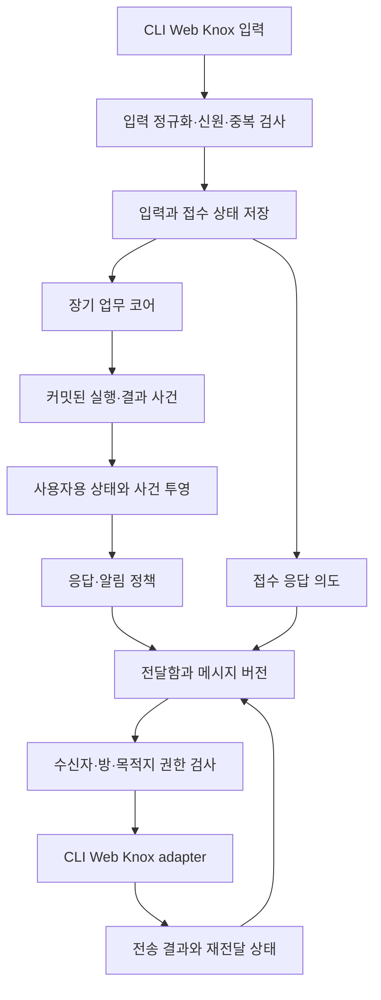

# 채팅 표시와 CLI·Web·Knox 채널 설계

2026-09-05 · v0.12 논의용 설계 · 채팅 UX·응답 전달·모드 선택 · 실제 채널 연동 전

## 1. 권고하는 대화 방식

**채팅에는 지시·접수·필요한 질문·최종 결과를 남기고, 진행은 같은 작업의 상태 표시를 갱신한다.** 도구 호출, 가설 내부 토론, 재시도, compact, 개별 worker 로그는 사용자용 상세 작업 화면/진단 경로에서 필요할 때 확인한다.

기본 알림은 접수 1회와 결과 1회다. 추가 입력이 필요하거나 중요한 범위/기한 변화·복구 불가능한 문제가 생기면 예외적으로 메시지를 보낸다. 이는 초기 UX 기본값이며 모든 업무의 메시지 수를 강제로 2개에 제한하는 규칙은 아니다. 사용자가 진행을 묻거나 더 자세한 알림을 원하면 그 선호를 적용한다.

사용자가 선택한 채널은 CLI, Web, Knox Messenger다. Knox MCP는 별도 구현되어 있다는 사용자 설명을 기준으로 연결 대상으로 두며, 이 문서에서는 실제 도구 이름·입력·송수신 지원·rich UI 기능을 확정하지 않는다.

실행 모드는 자동/빠르게/깊게를 제안한다. Web 입력 선택, CLI 옵션, Knox 자연어 지시를 같은 업무 정책으로 연결한다. 모드는 새 요청을 대상으로 하며 진행 중 업무 변경은 해당 업무에 명시적으로 연결한다. 깊은 조사 중의 상태 질문은 빠르게 답할 수 있고, 모드 전환마다 새 알림을 만들지 않는다. 지속 실행·알림 빈도·취소와 모드를 구분한다. [모드별 동작과 전환](/Users/seunghanee/Documents/secumon/design/11-execution-modes.md)

## 2. 정보의 세 가지 표시 수준

| 수준 | 내용 | 기본 표시 |
|---|---|---|
| 대화 | 요청·접수·사용자 결정이 필요한 질문·결과·중요 정정 | 채팅 본문 |
| 작업 상태와 근거 | 실제 단계, 기다리는 이유, 산출물·출처, 중요한 판단 이유, 남은 한계 | 작업 카드/상세 화면 또는 명시 조회 |
| 실행 진단 | 계획 버전·task/attempt·도구 호출·오류·재시도·비용·compact 이력 | 권한 있는 사용자가 진단 모드에서 확인 |

상세 화면도 허용된 view를 사용한다. 원문 로그와 사내 자료를 단순히 접었다 펴는 UI만으로 보호하지 않는다. 대화에 보이지 않는 실행 이력은 내구성 있게 보존하되 사용자에게 각 이벤트를 메시지로 중계하지 않는다. 모델의 비공개 사고 원문 표시는 전제로 하지 않는다.

## 3. 접수에서 최종 답변까지

### 접수는 실제 저장 사실을 근거로

1. 채널 입력을 발신자·대화/방·원본 메시지·요청 ID와 연결하고 인증/권한을 확인한다.
2. 재전송 여부를 검사한 뒤 입력과 업무 접수 상태를 저장한다. 목표 이해가 끝나지 않았으면 `요청 수신/범위 확인 중`으로 남긴다.
3. 코드 기반 짧은 접수 문구와 응답 의도를 저장한다. 긴 planning이나 별도 LLM 응답을 기다려야만 접수할 수 있는 구조로 두지 않는다.
4. 대화 담당이 구체 목표·범위를 확인하고 실행을 진행한다. 정보가 부족하면 질문하며, 접수 사실을 아직 확인되지 않은 실행 약속으로 부풀리지 않는다.

클라이언트의 `보내는 중/전송됨`은 서버의 업무 접수와 다르다. 저장에 실패하면 접수 완료라고 표시하지 않는다. 단순한 즉답 질문은 한 번의 답변으로 처리할 수 있지만 비동기 업무 지시는 접수 사실과 결과를 알려준다.

### 메시지 정책

| 사건 | 채팅 새 메시지 | 상태 표시/동작 |
|---|---|---|
| 업무 접수 | 짧게 1회 | 접수 또는 범위 확인 중 |
| 작업 시작·단순 단계 변경 | 기본적으로 추가하지 않음 | 현재 단계 갱신 |
| 도구 호출·재시도·compact | 추가하지 않음 | 상세 진단에만 기록 |
| 중요한 결과·범위 변경·유의미한 지연 | 사용자 영향과 알림 선호에 따라 | 변화와 이유를 묶어서 알림 |
| 사용자 결정/자료가 필요 | 필요한 질문을 한 번에 정리 | 입력 대기, 어떤 작업이 막혔는지 표시 |
| 사용자가 진행을 질문 | 현재 사실과 남은 조건에 답변 | 새 업무를 중복 생성하지 않음 |
| 결과 준비 | 결론·주요 근거·한계·산출물로 답변 | 해당 결과 버전 표시 |
| 취소 | 접수와 실제 중단 상태를 구분 | 신규 배정 중지와 진행 중 작업 정리 |
| 전달 실패·정정 필요 | 확인된 상태에 맞게 처리 | 같은 작업/결과와 연결하고 재전달/정정 |

‘계속 진행 중입니다’만 주기적으로 반복하지 않는다. 장기 업무의 무변화 상태는 Web/CLI에서 최신 확인 시각과 실제 상태로 확인할 수 있게 한다. Knox에서 정기 현황이 필요하면 사용자가 선택한 주기의 요약/질의 응답으로 제공한다. 내부 heartbeat를 사람용 메시지로 변환하지 않는다.

진행률과 ETA는 실제 측정 근거가 있을 때만 표시한다. 동적으로 바뀌는 task graph의 완료 노드 비율을 전체 목표 완료율로 표시하지 않는다. `자료 확인 중`, `응답 대기`, `결과 확인 중` 같은 의미 있는 상태를 우선한다. 자료 확인 건수도 실제 관측 범위와 연결한다.

## 4. 채널별 구현 방법

공통 사건·메시지 의미는 같게 유지하고 표현과 전송 기능은 adapter에서 달리한다.

| 기능 | Web | CLI | Knox Messenger |
|---|---|---|---|
| 접수 | 사용자 요청에 연결된 짧은 응답/작업 카드 | 업무 식별과 접수 한 줄 | 짧은 텍스트 접수와 필요한 업무 참조 |
| 진행 | 같은 카드의 상태 갱신 | TTY에서는 한 상태 줄/작업 목록 갱신 | 별도 진행 메시지는 기본 생략 |
| 상세 | 옆 패널 또는 펼침 영역에 근거·산출물·경과 | 상태/근거 조회, 선택적 verbose 진단 | 텍스트로 조회, 허용되는 경우 내부 상세 링크 |
| 질문 | 해당 작업에 연결된 질문·입력 | 명시 작업을 대상으로 질문/입력 | 발신자·대화와 업무를 매핑한 텍스트 질문 |
| 결과 | 읽기 쉬운 최종 답변과 산출물 | 최종 답변을 남기고 일시 상태 표시 정리 | 짧은 결과 요약, 필요한 상세 참조 |
| 재접속 | snapshot + 이후 공개 사건 복원 | 저장 업무 ID로 재접속/조회 | 원본 메시지/업무 참조로 이어받기 |

### Web

메인 대화는 기본적으로 한 명의 대화 담당이 말한다. 내부 에이전트들의 발화를 각각 별도 말풍선으로 만들지 않는다. 한 업무의 접수와 진행은 같은 작업 카드에 묶고, 결과는 읽을 수 있는 답변으로 남긴다. 이미 사람이 한 질문·결정·중요 정정은 이력에서 지우지 않는다.

여러 업무는 짧은 제목과 식별 가능한 참조로 구분하고 작업 전환/목록을 제공한다. 오래된 대화를 읽는 중에는 새 메시지 때문에 하단으로 강제 이동하지 않는다. `새 메시지` 표시로 복귀할 수 있게 하며 입력 포커스를 빼앗지 않는다. 모바일에서는 상세 패널을 페이지/접힘 영역으로 바꾼다.

토큰 스트리밍은 같은 답변 영역을 갱신한다. 생성 중인 답변은 확정된 실행 사실이나 완료로 표시하지 않는다. 보안/권한상 출력 검사가 필요한 내용은 검사 전 토큰을 외부 채널로 보내지 않고 준비 상태를 보여준다. 전송 도중 단절되면 확정 메시지와 생성 중 버퍼를 구분해 복원한다.

웹 전송은 초기 후보로 명령용 HTTP 요청과 서버 공개 사건용 SSE를 둔다. 복구는 snapshot과 이후 cursor를 함께 사용하고 중복/순서 뒤바뀜을 처리한다. cursor가 보존 범위를 벗어나면 새 snapshot에서 이어간다. 연결 재수립은 분석 재시작 명령이 아니다. 양방향 상시 연결이 실제로 필요할 때 WebSocket을 비교하며, MCP/A2A를 브라우저 대화 전송 형식으로 강제하지 않는다. 구체 프록시·인증·연결 한도는 P0/P1에서 확인한다.

SSE의 서버→클라이언트 방향, 재연결, 이벤트 ID 기능은 [MDN 설명](https://developer.mozilla.org/en-US/docs/Web/API/Server-sent_events/Using_server-sent_events)을 참고했다. 업무 snapshot·권한·중복 제거·cursor 보존 규칙은 SSE 자체의 보장이 아니라 새 애플리케이션이 구현할 계약이다.

답변은 텍스트·근거 참조·산출물 참조·질문·상태 같은 제한된 내용 블록과 업무/메시지/버전 메타데이터로 구성한다. Web의 허용된 Markdown, CLI 텍스트, Knox 텍스트로 각각 렌더링한다. 모델이 만든 임의 HTML을 직접 실행하지 않고, 클릭/답변 행동도 서버에서 대상·권한·현재 버전을 다시 확인한다. 첨부가 있으면 업로드 완료와 자료 읽기 가능 상태를 구분하고, 채팅 기록에 전체 원문을 자동 삽입하지 않는다.

상태는 색만으로 표현하지 않고 텍스트로 제공한다. 화면 읽기 도구에는 의미 있는 변경을 `status`/적절한 live region으로 알리되 토큰마다 읽어주지 않는다. 자동 갱신이 읽기를 방해하지 않는지 키보드·화면 읽기 도구로 평가한다. [W3C 상태 메시지 설명](https://www.w3.org/WAI/WCAG22/Understanding/status-messages.html), [자동 갱신 제어 설명](https://www.w3.org/WAI/WCAG22/Understanding/pause-stop-hide.html)

### CLI

TTY에서는 접수·질문·최종 결과를 남기고, 실행 중 상태는 같은 줄을 갱신한다. 로그를 줄마다 채팅에 쌓지 않는다. 긴 진단은 사용자가 선택한 명령/verbose 경로로 제공하고, 사용자 답변과 기계용 출력을 섞지 않는다.

파이프/비TTY 모드에서는 ANSI·스피너·커서 이동을 쓰지 않는다. 사람이 읽는 확정 출력 또는 명시적인 구조화 사건 모드를 제공한다. stdout/stderr의 역할과 종료 코드는 계약으로 고정한다. 구조화 모드 역시 원문 비밀 정보를 자동 노출하지 않는다.

창 닫기·연결 단절은 원격 업무 취소를 의미하지 않는다. CLI의 명시 중지 명령은 대상 업무에 취소를 요청한다. 대화형 전경 작업에서 Ctrl-C를 취소로 매핑한다면 요청 전송과 중단 확인을 구분하며, 연결만 끊겼을 때 중지 완료로 출력하지 않는다. 여러 업무가 있으면 대상이 명확해야 한다.

### Knox: 확인 전에는 텍스트 중심

기존 MCP의 기능을 확인한 뒤 adapter를 만든다. 전용 카드·버튼·스레드·메시지 수정·읽음 확인을 현재 지원한다고 가정하지 않는다. 텍스트 접수 → 필요한 질문 → 결과로 기본 대화가 가능해야 하며, 실제 지원되는 기능만 점진 적용한다.

텍스트 전송만 가능하고 입력 수신이 없다면 완전한 Knox 대화 채널이 아니다. 발신자/방/원본 메시지 ID를 포함한 입력 경로를 확인하거나 보완해야 한다. 메시지 수정이 지원되더라도 사용자에게 필요한 최종 결과 알림이 조용히 사라지지 않게 한다.

여러 업무나 스레드 미지원 상황에서는 짧은 업무 참조를 포함한다. 길이/서식 제한이 있으면 허용된 짧은 결론을 전송하고 상세는 인증되는 내부 화면/산출물로 제공한다. 자동으로 긴 답변을 수십 개 메시지로 나누지 않는다. 첨부·링크 지원과 수신자의 접근 가능성도 실제 계약을 확인한다.

## 5. 대화 예시

가상 자료에 대한 기본 흐름:

> 사람: 문서 A와 B의 운영 제약을 비교해줘.
>
> 접수: 요청을 받았습니다. 두 문서를 비교한 뒤 근거와 함께 정리하겠습니다.
>
> Web/CLI 상태: 자료 확인 중 → 내용 비교 중 → 결과 확인 중
>
> 결과: 두 문서는 적용 범위가 다릅니다. A는 단일 지역, B는 여러 지역 운영을 전제로 합니다. 주요 제약과 근거를 비교표에 정리했습니다.

기본 Knox 대화에는 위 상태 변경마다 별도 메시지를 보내지 않는다. 질문이 필요하면 `어느 개정판을 기준으로 비교할까요?`처럼 실제 결정을 요구하는 내용을 모아서 전달하고 해당 업무를 입력 대기로 표시한다.

접수 문구는 저장된 요청 이해 수준에 맞춘다. 아직 문서 대상을 식별하지 못했다면 `요청을 받았습니다. 비교할 문서의 위치를 확인하고 있습니다` 또는 필요한 질문을 사용한다. 사용자의 입력을 실제보다 더 구체적으로 이해한 것처럼 말하지 않는다.

## 6. 코어와 채팅 사이에 둘 계층

입력과 출력은 durable inbox/outbox로 관리한다. 공개 사건은 `request_received`, `work_accepted`, `status_changed`, `input_required`, `result_ready`, `result_corrected`, `cancel_requested`, `cancelled` 등 의미 있는 종류로 제안한다. 최종 enum/스키마는 구현 시 확정한다. 내부 tool/replan/compact 사건과 공개 사건은 일대일 대응하지 않는다.

각 메시지는 업무·목표/결과 버전·대화·수신 범위·원인 사건과 연결한다. 공개 상태는 현재 버전을 투영하고, 실제 전달한 메시지는 별도 이력으로 보존한다. LLM은 허용된 사실과 근거를 읽기 쉽게 표현할 수 있지만, 접수·진행·완료라는 상태 자체를 자유 생성하지 않는다.

정상적인 단계 변경은 묶어서 최신 상태로 덮어 쓰고 대기 중인 낡은 진행 알림은 합친다. 결과가 준비되면 아직 전송되지 않은 일상 진행 알림은 제거한다. 사용자 입력 요청·실패·중요 정정은 의미 없이 합치지 않으며 이미 해결된 질문이 늦게 전송되지 않게 원인 버전을 확인한다.

같은 업무에서는 접수 뒤 결과가 보이도록 순서를 관리한다. 여러 업무 사이에는 독립 진행을 허용하되 업무 참조로 구분한다. 과부하가 생기면 진행 사건을 합치고 접수·입력 요청·취소·결과를 우선 처리한다. 중지 요청은 긴 LLM 호출 종료까지 무조건 기다리게 하지 않고 실행 관리자에게 전달한다.

## 7. 작업 성공과 답변 전달을 구분

산출물 준비, 목표 충족, 채널 전송 성공, 사용자가 읽음은 다른 사실이다. `result_ready`에서 검증된 결과를 전달함에 넣고 전송 결과를 추적한다. 채널 전송 실패 때문에 분석을 처음부터 다시 실행하지 않는다.

목표에 실제 전달이 포함되면 전달 의무가 충족된 후 최상위 업무를 완료한다. 단순 산출물 완성이 목표라면 분석 상태와 알림 전송 상태를 각각 표시한다. ‘업무 완료 사건이 있어야만 최종 답변을 보내고, 답변을 보내야만 업무 완료가 된다’는 순환을 만들지 않는다.

MCP 호출 성공만으로 Knox 수신자에게 전송됐다고 가정하지 않는다. 실제 의미 상태·외부 메시지 ID·영수증을 계약에서 확인한다. 읽음 확인이 없으면 전송됨을 읽음으로 표시하지 않는다. timeout 후 결과가 불명확하면 `전달 확인 필요`로 두고 지원되는 조회/멱등키로 대조한다. 지원되지 않는 서버에 정확히 한 번 전송을 보장한다고 말하지 않는다.

새 목표 버전이 생긴 뒤 전송 대기 중인 옛 결과는 적합성을 재검사한다. 이미 전달한 결과가 중요한 근거로 수정되면 정정 사실과 변경점을 알리고 이전 결과와 연결한다. 중요한 답변을 사람 모르게 바꿔 이력을 지우지 않는다.

## 8. 채널 연결과 사용자 통제

각 채널의 계정·방·대화는 검증된 내부 사용자 신원과 매핑한다. 표시 이름이 같다는 이유로 동일 사용자나 업무 소유권을 추정하지 않는다. 다른 채널에서 같은 업무를 열면 다시 권한을 확인한다.

업무마다 기본 응답 경로를 정한다. 처음 요청한 경로를 기본으로 두고 사용자 선택에 따라 변경한다. 모든 채널에 동일 알림을 무조건 복제하지 않는다. Web에서 상태를 봤다는 이유만으로 Knox 응답 경로를 임의 변경하지 않는다.

단체방은 요청자 한 명의 열람 권한만으로 결과를 공개할 수 없다. 방에 공개 가능한 범위와 수신자 정책을 적용하고, 방 참여자나 권한이 바뀌면 전송 직전에 재검사한다. 민감한 결과는 정책이 허용하는 안내와 인증된 상세 조회로 연결한다. 링크 자체를 접근 권한으로 쓰지 않는다.

진행 알림 수준은 기본/주요 변화/상세 요청과 같은 설정으로 제안하며, 조용한 시간·기한·긴급 입력 필요의 예외를 함께 정의한다. 설정은 업무별 또는 사용자 기본값으로 저장한다. 대화에서 나온 다른 에이전트의 지시나 인용문을 실제 사람의 취소·승인으로 승격하지 않는다.

## 9. 함께 보강할 나머지 핵심 항목

기능을 더 늘리기 전에 다음 계약을 확정하는 것이 우선이다. 일부는 기존 문서의 원칙을 실제 운영 계약으로 구체화하는 작업이다.

| 항목 | 필요한 이유 | 설계/검증 위치 |
|---|---|---|
| 사람 입력·응답 의무와 전달 장부 | 접수 누락, 중복 답변, 응답이 없는 완료 방지 | 이 문서와 P1/P3 |
| 업무별 통제·신원·범위 연결 | 여러 업무/채널에서 변경·취소 대상 혼동 방지 | 07/08 및 이 문서 |
| 사건 재생·버전 이행·평가 | 모델/프롬프트/skill/코드 변경 뒤 품질·복구 회귀 확인 | 03/08/09 |
| 운영 제한·공정한 큐·과부하 처리 | 상시 임무가 대화 응답과 취소를 밀어내지 않게 함 | 03/09와 채널 우선순위 |
| 결과·기억의 보존/삭제와 정정 | 오래된 근거·권한 철회·잘못된 공유 지식 반영 | 02/05/08/09 |

이 항목들이 구현됐다는 뜻은 아니다. 코어와 대화 계약을 합성 시나리오로 검증하면서 기준·정책·스키마를 확정한다.

## 10. 구현·평가 순서

1. 공통 공개 사건·응답 정책·입출력 장부와 fake channel을 만든다. 접수/결과 중복·순서·권한·목표 변경을 테스트한다.
2. CLI와 Web에 같은 시나리오를 연결한다. 도구/compact 사건이 많아도 채팅이 불필요하게 길어지지 않는지, 진행·입력 대기·취소를 이해할 수 있는지 평가한다.
3. Knox MCP의 입력 수신·발신자/방 식별·텍스트 전송·오류·메시지 ID·조회/수정·기타 지원을 확인하고 텍스트 대화를 먼저 연결한다.
4. 지원되는 기능에 한해 스레드·수정·첨부 등을 적용한다. 이를 지원하지 않는 경우에도 기본 대화 의미가 유지되어야 한다.

평가 항목: 접수 표시 지연, 접수의 실제 저장 일치, 업무당 사용자용 메시지 수, 유용한 알림 비율, 결과 전달 지연·중복·누락, stale 진행/결과 발생, 재접속 복원, 오래된 대화 읽기/입력 유지, 화면 읽기 도구의 알림 과다, 취소 반영 시간, 채널/방 권한 일치.

대표 시험: 내부 사건 다수 → 접수·결과 중심 대화, 추가 입력 필요 → 질문 1회와 올바른 재개, 전송 timeout → 분석 재실행 없이 대조, 목표 변경 → 이전 결과 전송 재검사, Web/CLI 연결 단절 → 업무 유지, Knox rich 기능 없음 → 텍스트 흐름 유지. 합성 UI 예시는 실제 Knox 화면이나 MCP 동작 검증 결과가 아니다.
