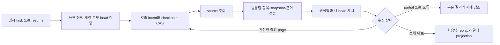

# P2-04 영속 조회 실행: 학습과 결과

2026-09-05 · v0.24 · 로컬 구현 단위 검증 완료, P2-04 전체는 진행 중

[이번 계획](/Users/seunghanee/Documents/secumon/design/chapters/P2-durable-collections-plan.md)에 따라 조회 중단/재개를 실행 정본에 연결했다. 고정 Node 24.20.0에서 전체 **842개 시험 통과·실패 0**, 코어 별도 타입 검사, 안쪽 계층 64파일/위반 0, 합성 4시나리오/22판정이 통과했다. [검증 기록](/Users/seunghanee/Documents/secumon/runtime/evidence/P2-durable-collections-local-verification.json)과 [전체 로그](/Users/seunghanee/Documents/secumon/runtime/evidence/P2-durable-collections-verify.log)에 실행 및 소스 153개 hash를 저장했다.

## 이번에 구분한 것

한 tool attempt가 여러 page를 조회할 수 있다. 바깥 시도 수, 내부 호출 의도, 실제 받은 응답, 검증한 항목과 완료된 수집은 각각 다른 사실이다. 호출 전에 intent를 기록하고, 허용된 응답을 검증해 원문 artifact와 새 checkpoint를 함께 게시한다. 응답 없는 intent도 호출 예산을 차지하지만 실제 외부 전송 성공을 증명하지 않는다.

예를 들어 A는 성공하고 B는 아직 실패한 page를 받으면 A의 근거 ID와 관측 시각을 유지한다. 즉시 B를 반복 호출하지 않고 partial 결과를 정리한다. 다음 계획이 새 task ID와 이전 attempt/checkpoint ID를 지정하면 B만 다시 조회한다. 그 page가 완전해지면 다음 page를 이어 읽는다. 모델은 원 cursor를 수정하지 않는다.

## 구현 흐름

재개는 terminal parent의 최신 head를 단일 successor가 차지하는 CAS로 시작한다. 이전 실패/unknown과 사용한 예산을 그대로 물려받는다. 완료 checkpoint를 저장했지만 바깥 결과를 저장하지 못한 경우에는 새 조회 없이 원 결과를 다시 구성한다. 이미 완료·채택한 parent를 같은 방식으로 재개하는 것은 거부한다.

## 코드 읽는 순서

| 파일 | 확인할 연결 |
|---|---|
| [read-checkpoint.ts](/Users/seunghanee/Documents/secumon/runtime/src/domain/read-checkpoint.ts) | 원응답 참조·call 이력·parent·진행 요약 |
| [read-collections.ts](/Users/seunghanee/Documents/secumon/runtime/src/application/read-collections.ts) | intent 선저장, source 호출, page 게시, explicit resume |
| [read-checkpoints.ts](/Users/seunghanee/Documents/secumon/runtime/src/application/read-checkpoints.ts) | dispatch 영수증, 현재 정책/계약, 부모 claim, raw replay, projection 검증 |
| [compose-runtime.ts](/Users/seunghanee/Documents/secumon/runtime/src/application/compose-runtime.ts) | collectionTools로 읽기 제공자 주입 |
| [execution-runtime.ts](/Users/seunghanee/Documents/secumon/runtime/src/application/execution-runtime.ts) | receive/adopt의 collection proof 검사 |
| [context-compiler.ts](/Users/seunghanee/Documents/secumon/runtime/src/application/context-compiler.ts) | 재개 tip 필수 보존, 완료 조회도 원본 재검사 |

collection은 읽기 전용이며 일반 결과 캐시 대상에서 제외한다. fresh와 readResume를 동시에 지정할 수 없다. 본체는 ArtifactStore/StateRepository 포트를 사용하므로 PostgreSQL을 요구하지 않는다. 업무에 새 수집 도구를 배치할 때는 manifest 또는 페이지 제공자, 입출력 스키마, 상한과 정책을 등록한다.

## 확인한 정상·실패·복구

| 시험 파일 | 개수 | 확인한 사실 |
|---|---:|---|
| [read-collections.test.ts](/Users/seunghanee/Documents/secumon/runtime/src/tests/read-collections.test.ts) | 24 | 두 backend×두 업무군 정상/부분 조회, batch 재시도, 실패 예산, 정책/목표 변경, 늦은 취소 응답, 실제 프로세스 종료 복구 |
| [read-checkpoints.test.ts](/Users/seunghanee/Documents/secumon/runtime/src/tests/read-checkpoints.test.ts) | 16 | proof/출력 위조, 원응답·원자료 삭제, 부모 claim, 복사 조회, 완료 checkpoint 뒤 결과 저장 실패의 0-fetch 재개 |
| [read-collection-context.test.ts](/Users/seunghanee/Documents/secumon/runtime/src/tests/read-collection-context.test.ts) | 22 | 5회 compact와 reopen, 필수 tip 예산, 원본과 파생 frame 유실 구분, 계약/원본 변경, 완료·채택된 복사 본문 보호 |

신규 62개와 이전 780개를 합쳐 842개다. source 진입 직후 자식프로세스를 실제 종료한 시험과, 완료 결과 put만 실패시키는 adapter 대역 시험을 구분했다. 사용자가 중단한 실제 모델/API·사내 서비스 시험은 수행하지 않았다.

첫 targeted 75/77과 중간 전체 821/822에서 발견한 두 표현/시험 문제를 보정했다. 이후 독립 검토가 완료·채택된 조회의 원본 유실을 context가 놓치는 경로를 찾아 보강했다. 신규 targeted 62/62 뒤 마지막 전체 verify를 실행했다. 원본 아카이브/추출 1,973파일과 dependency lock, 이전 780개 검증 기록은 보존했다.

## 비용과 보장 범위

현재 attempt가 받은 응답의 보고 비용만 새 시도에 합산한다. 부모 비용은 재합산하지 않고, 실패나 응답 불명의 실제 비용은 null로 둔다. 남은 호출 예산은 모든 durable intent를 기준으로 계산한다.

과거 checkpoint head와 원응답을 모두 보존하고 반복 검증하므로 저장/조회 비용이 커질 수 있다. 과거 head도 누적 본문을 포함해 한 번의 검증 bytes가 페이지 수에 대해 이차적으로, 전체 반복이 삼차적으로 증가할 수 있다. 이는 코드 구조상 한계이며 실측 성능 수치가 아니다. 이번 단위에서 I/O 절감이나 배포 성능 개선을 주장하지 않는다.

현재는 전체 목표·정책·수명이 같을 때만 이어간다. 원응답 replay는 제공자가 주장한 snapshot/항목/총수의 일관성을 확인하며 외부 자료의 진실성과 발견 완전성을 증명하지 않는다. 개별 부분 근거가 목표 criteria를 충족하는 것과 전체 collection 완료도 구분한다. 읽기 재개는 외부 exactly-once를 보장하지 않으며, source·artifact 검사와 work CAS의 분산 원자성 및 물리 보존/삭제는 별도 문제다.

## 다음 학습 단위

P2-04의 내부 조회/파싱/검증 비용을 실제 ArtifactStore get·exists·bytes·hash·receipt 단위로 측정한다. 검증 결과를 짧은 실행 안에서 안전하게 공유하고 checkpoint의 누적 본문과 진행 델타를 어떻게 나눌지 비교한다. 검증기를 생략해 호출 수만 줄이는 방식은 완료 조건을 충족하지 않는다. 실제 모델이 필요한 상위 조건과 나머지 P0–P6 계획은 유지한다.
