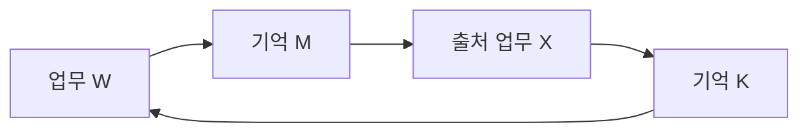

# 입력 출처를 유한한 그래프로 검증하기

2026-09-06 · v0.45 · 공통 그래프/기억 경로 검증 완료 · P4-01 진행 중

## 학습할 개념

이런 참조를 처리할 때 `visited` 표시는 ‘이미 읽음’을 의미한다. ‘현재에도 사용 가능함’은 별도로 확인해야 한다. 구현한 그래프는 각 스냅샷을 한 번 수집하고, 모든 참조의 버전 기대와 업무별 규칙을 검사한 뒤 마지막 유효성 확인을 수행한다. 원본 접근 권한이나 자료가 바뀌면 결과를 반환하지 않는다.

서로 인용했다고 독립 출처가 늘어나지는 않는다. 일반 참조 그래프의 순환과 근거 자체의 `derivedFrom` 순환도 다르다. 기억 adapter는 후자를 계속 거절한다. 이 검증 결과가 증거의 진실성이나 업무 완료를 대신하지 않는다.

## 구현

- `InputValidationGraph`: 제공자와 내부 key, 선택적인 버전 기대를 사용한다. 참조가 다시 등장해도 충돌 검사를 생략하지 않는다. 도중에 읽은 자료를 다른 동시 호출과 공유하지 않는다.
- 스냅샷을 모은 뒤 동기적인 업무 의미 검사를 실행한다. 의미 검사에 실패하면 불필요한 guard 조회를 수행하지 않는다. 이후 모든 node의 현재 자료·권한을 확인하고, 다른 guard를 기다리는 사이 앞서 읽은 자료가 만료했는지도 다시 확인한다.
- 기본 상한은 node 256개·참조 1,024개·스냅샷/참조 4MiB·10초다. 취소·시간 초과·뒤로 이동하거나 유효하지 않은 clock, 없는 provider, 잘못된 응답은 고정된 실패 결과를 반환한다. 출처 ID와 adapter의 비공개 오류를 결과에 포함하지 않는다.
- `KnowledgeService`의 기존 업무/기억 출처 추적을 공통 그래프에 연결했다. 기억의 256개 논리 항목 제한, current source·정책·등급·검토 상태·부모 버전 검사는 계속 적용한다. guard에서는 업무/기억의 캡처 내용과 현재 저장소 내용을 비교한다.
- 이미 만료된 기억은 사용할 수 없는 입력으로 처리한다. 조회 도중 변경된 자료의 충돌과 구분하여 만료된 내용을 일시적인 경합으로 재시도하지 않게 했다.
- 기억 도구의 호출별 AbortSignal을 KnowledgeService와 그래프까지 전달했다. 지속 입력 출처가 응답 대기 중이어도 취소 신호를 받으면 도구가 cancelled로 종료하고, 늦은 응답을 결과·근거·입력 의존성에 채택하지 않는다.

## 검증

관련 **158/158** 시험이 통과했다. 신규 그래프 시험 18개와 기억 도구 취소 통합 시험 2개, 기존 기억 저장·도구·runtime·게시판 시험을 함께 실행했다. 일반 입력 경로의 조회 횟수와 순환 의존성의 유한 조회도 통과했다. 첫 관련 실행에서 이미 만료된 기억 2개가 `knowledge_contention`으로 분류되는 문제가 드러났고, 의미에 맞게 `knowledge_unavailable`로 처리한 뒤 통과했다.

취소 시험은 SQLite/파일 저널 **상태 저장소**에서 수행했고, 기억 저장소는 두 경우 모두 SQLite를 사용했다. 출처 응답의 대기를 해제하기 전에 도구가 cancelled로 종료하는지 확인했다. 응답 해제 후에도 호출 업무가 바뀌지 않고 반환 결과에 본문·근거·입력 의존성이 없음을 검사했다.

최종 `npm run verify`는 **2,200/2,200**, 실패·취소·skip 0으로 통과했다(305273.193166ms). 빌드·코어 타입, 계층 109파일/위반 0, 합성 4개 시나리오/22개 체크포인트도 통과했다. 취소 신호 연결 전 전체 2,198개 실행과 첫 관련 실패 로그도 보존했다. [실행 기록](/Users/seunghanee/Documents/secumon/runtime/evidence/P4-board-input-graph-local-verification.json).

## 남은 일

다음은 게시판 페이지의 지속 입력 증명과 runtime 읽기 도구다. 그 뒤 쓰기·영수증 대조·작업 의무·역할 간 예산·두 runtime의 반증/가설/재계획·compact를 연결한다. 현재 그래프는 게시판 입력을 자동으로 추적하지 않는다. 서로 다른 주체의 현재 namespace/검토 권한을 확인할 내부 계약도 아직 연결해야 한다.

기억 검증의 최종 guard는 현재 저장소 포트의 `get`을 사용한다. 따라서 ‘스냅샷 한 번’은 전체 I/O 1회를 뜻하지 않는다. adapter가 버전/권한 metadata를 별도로 제공하면 이 부분을 더 줄일 수 있다. 바이트 상한은 스냅샷/참조 예산이며 전체 전송량 측정이 아니다.

취소 신호를 무시하는 reader의 대기는 끝낼 수 있지만 그 I/O의 종료까지 증명하지는 않는다. 실제 transport 취소·연결 종료는 adapter에서 검증해야 한다. 이번에는 로컬 자료와 합성 시험을 사용했고 모델/API·사내 서비스는 실행하지 않았다. P4-01과 전체 P0~P6는 진행 중이다.

[구현 계획](/Users/seunghanee/Documents/secumon/design/chapters/P4-input-validation-plan.md) · [전체 연결 계획](/Users/seunghanee/Documents/secumon/design/chapters/P4-board-runtime-plan.md)
